# 故检修理线配套软件系统技术方案

## 一、需求理解

#### 1.1 项目背景

车间已通过 PCS 系统实现数字化工卡管理，但是在故检修理产线现场，从分拣、故检、修理到收发的全链路仍存在多处数字化断点：工卡中的检测数据仍主要依赖操作员从测量工具读数后手工填写；修理过程、委外与报废处置缺乏与修理设备联动的标准化系统留痕；形迹托盘码盘齐套依赖人工核对；故检不合格后的复检、复修循环缺乏系统管控；零件流转追溯困难、异常呼叫响应滞后。为提升故检修理产线执行环节的数字化水平，亟需建设一套与 PCS 协同、覆盖分拣-故检-修理-收发全工位，集测量工具与修理设备集成、检测数据自动采集、修理过程管控、形迹托盘数字化管理、质量追溯于一体的产线执行管理系统。

#### 1.2 业务痛点分析

- **工卡数据填写低效**：PCS 侧工卡已数字化，但故检环节测量数据需依赖测量工具人工读数抄录，速度慢、易出错，无法与测量工具联动
- **数据链路未贯通**：测量工具与工卡脱节，检测数据不能自动采集、判异；修理设备与工卡脱节，修理、委外、报废处置过程无系统化记录，执行结果难以及时汇总
- **修理流程不闭环**：故检不合格后的修理、复检、复修循环缺乏工位级一键流转的能力，委外件、报废件分流不规范，易出现漏检、错流
- **形迹托盘管理粗放**：形迹托盘内衬卡槽无数字化映射，齐套性校验效率低、易出错
- **追溯能力弱**：零件出入库、检测、修理、委外记录分散，质量问题追溯困难
- **异常响应不及时**：现场测量工具或修理设备故障、工艺疑问等呼叫无统一推送渠道，产品技术员与操作员(组长)无法实时感知现场异常


#### 1.3 建设目标

建设一个**工位侧执行管理系统**——**紧贴分拣-故检-修理-收发一线作业与现场操作人员**，不替代 PCS 等上层计划与管控职能；依据本产线业务特点，**有选择地整合 PCS、PCS-AGV 物流等上层与外围系统能力**，聚焦工卡落地执行与现场数据采集；**以工位操作便捷为核心设计原则**，采用桌面客户端、主副屏协同与一键式操作，降低多系统切换与现场作业负担。在此基础上，具体建设目标如下：

1. 承接 PCS 数字化工卡，实现分拣、故检、修理、收发全工位的接收、执行、回填与完工报工全流程可视化
2. 集成各类测量工具，实现检测数据自动采集、自动填入工卡、公差判异
3. 打通与 PCS 生产控制系统的数据链路：PCS 下发含完整工位、物料、WBS 工艺信息的工卡至本系统服务端，由服务端分发至工位客户端
4. 通过集成 PCS-AGV 物流模块实现零件转运一键申请、状态实时跟踪，本系统仅作为调用入口
5. 建立形迹托盘存料数字化模版管理体系，实现分拣工位可视化码盘与自动齐套校验
6. 覆盖修理全流程管控，支持修理执行记录、委外单拆分打印、报废登记，形成故检-修理-复检的业务闭环
7. 建立故检线边库数字化台账，覆盖待委外缓存、零件暂存（待处理）、报废三类库存，实现零件出入库闭环管理与全流程追溯
8. 提供产线实时监控大屏，**用于生产状态可视化监控**
9. 建设异常呼叫通知体系，通过专属接收客户端实现现场异常向技术员、操作员(组长)的实时推送通知


#### 1.4 系统定位

本系统定位为故检修理产线的**执行层管理系统**，上接 PCS 生产控制系统（不直连车间仓储控制管理系统WES、不直连车间AGV调度系统、不直连其他外部系统），下连各类测量工具及修理设备，承上启下实现生产指令的落地执行、生产数据的实时采集与工卡执行结果回传，是连接计划层与工具设备层、覆盖分拣-故检-修理-收发全工位作业的关键枢纽。

## 二、关键业务流程


#### 2.1 整体业务流程

故检修理产线的核心业务流程围绕「工卡驱动、分工作业、闭环流转」展开，覆盖从工卡下发到完工入库的全链路过程，包含故检-修理-复检的循环闭环，以及合格入库、委外、报废三类分流路径。

**主流程主线**：PCS 下发完整工卡至本系统服务端 → 服务端按工位属性分发至对应工位客户端 → 分拣工位清点码盘、齐套校验 → 故检工位检测判异 → 合格件经修理工位流转至收发工位入立库 / 不合格件流转至修理工位 → 修理工位执行修理/委外/报废处置 → 修理完成 PCS 增复检工卡（待定） → 故检工位复检 → 最终合格件经收发工位入立库缓存。

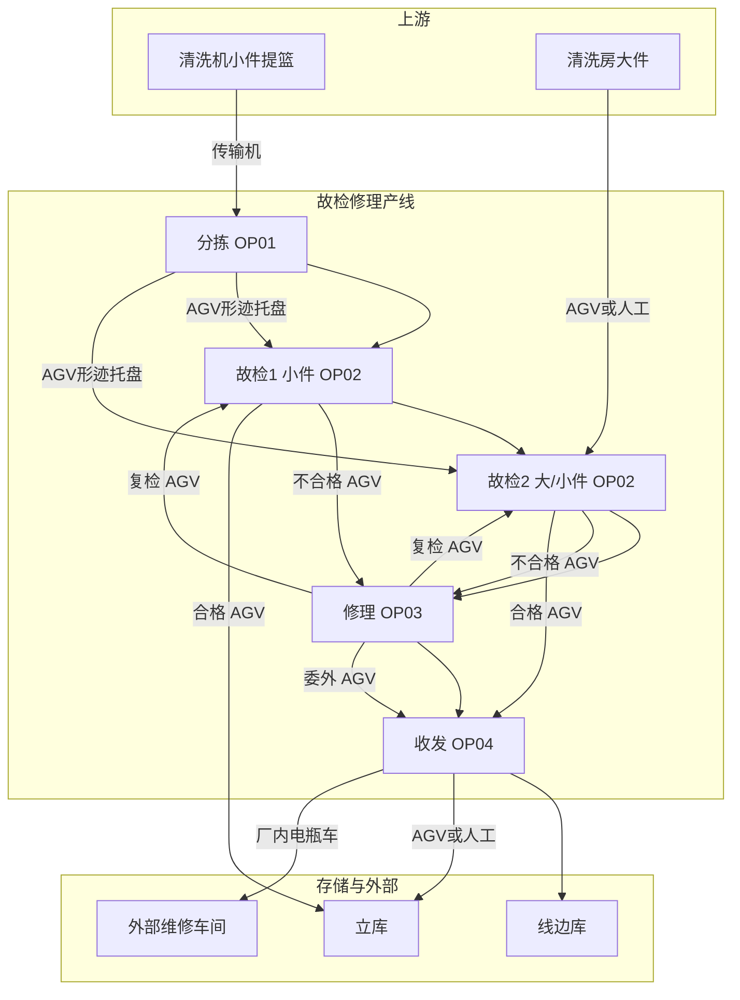
```mermaid
flowchart TB
  subgraph upstream [上游]
    direction LR
    WashSmall[清洗机小件提篮]
    WashLarge[清洗房大件]
  end
  subgraph line [故检修理产线]
    direction LR
    Sort[分拣 OP01] --> Insp1[故检1 小件 OP02] --> Insp2[故检2 大/小件 OP02] --> Repair[修理 OP03] --> RcvSend[收发 OP04]
  end
  subgraph storage [存储与外部]
    direction LR
    LineSide[线边库]
    ASRS[立库]
    ExtRepair[外部维修车间]
  end
  WashSmall -->|传输机| Sort
  WashLarge -->|AGV或人工| Insp2
  Sort -->|AGV形迹托盘| Insp1
  Sort -->|AGV形迹托盘| Insp2
  Insp1 -->|不合格 AGV| Repair
  Insp2 -->|不合格 AGV| Repair
  Repair -->|复检 AGV| Insp1
  Repair -->|复检 AGV| Insp2
  Repair -->|委外 AGV| RcvSend
  RcvSend --> LineSide
  RcvSend -->|AGV或人工| ASRS
  RcvSend -->|厂内电瓶车| ExtRepair
  Insp1 -->|合格 AGV| ASRS
  Insp2 -->|合格 AGV| RcvSend
```


#### 2.2 工卡接收与分发流程

本流程承接 PCS 已下发的数字化工卡，由**服务端统一接收**后按工位属性分发至对应工位客户端，确保各工位只处理与本工位类型匹配的工卡。各工位作业完成后，由服务端统一向 PCS 上报该工位的**工卡执行结果**。

**（1）PCS 下发工卡内容要求**

PCS 向本系统服务端推送的工卡须包含完整信息：


| 数据类别   | 包含内容                                                            |
| ------ | --------------------------------------------------------------- |
| 工卡基础信息 | 任务号、架次、计划时间等                                                    |
| 工位归属   | 工卡所属工位类型：分拣 / 故检1 / 故检2 / 修理 / 收发                               |
| 物料清单   | 零部件编码、数量；**是否默认委外**及委外方；**是否只换不修**                              |
| WBS 信息 | 本产线相关的工艺要求、检测项、公差标准；工艺文档/文件/视频的**访问地址**（不含其他产线信息）；视频地址须支持客户端内播放 |


本系统向 PCS 提供 **WBS 标准结构**规范，PCS 下发工卡时按该结构组织 WBS 树形数据。字段定义、`inspectionItems` 与 `processResources` 结构及 JSON 示例见 **3.4.5 节「PCS 下发工卡中的 WBS 信息内容」**。

**（2）分发与执行步骤**

1. PCS 通过 TCP/IP 接口向本系统服务端推送数字化工卡
2. 服务端接收后按工位属性自动分发至分拣、故检1、故检2、修理、收发对应工位的客户端
3. 客户端实时接收工卡，按「未接受 / 待处理 / 处理中 / 已完成」四种状态分类展示
4. 操作员查看任务详情，确认后一键接受任务，系统记录接受时间与操作人员（本系统内部）
5. 工位作业全部完成后，操作员提交工卡执行结果，由服务端汇总后**上报 PCS**

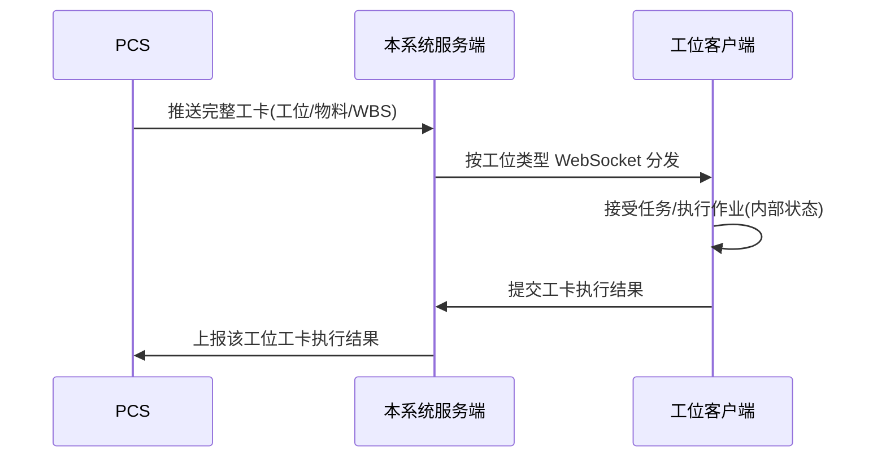
```mermaid
sequenceDiagram
  participant PCS
  participant Server as 本系统服务端
  participant Client as 工位客户端
  PCS->>Server: 推送完整工卡(工位/物料/WBS)
  Server->>Client: 按工位类型 WebSocket 分发
  Client->>Client: 接受任务/执行作业(内部状态)
  Client->>Server: 提交工卡执行结果
  Server->>PCS: 上报该工位工卡执行结果
```


#### 2.3 分拣作业流程（OP01）

分拣工位负责小零件清点、码盘与齐套校验，通过形迹托盘数字化模版实现可视化码盘与齐套判定。

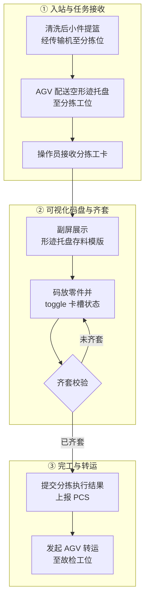
```mermaid
flowchart TB
  subgraph s1 [① 入站与任务接收]
    direction LR
    A[清洗后小件提篮<br/>经传输机至分拣位] --> B[AGV 配送空形迹托盘<br/>至分拣工位] --> C[操作员接收分拣工卡]
  end
  subgraph s2 [② 可视化码盘与齐套]
    direction LR
    D[副屏展示<br/>形迹托盘存料模版] --> E[码放零件并<br/>toggle 卡槽状态] --> F{齐套校验}
    F -->|未齐套| E
  end
  subgraph s3 [③ 完工与转运]
    direction LR
    G[提交分拣执行结果<br/>上报 PCS] --> H[发起 AGV 转运<br/>至故检工位]
  end
  C --> D
  F -->|已齐套| G
```


1. 清洗后小零件提篮通过传输机送至分拣位；空形迹托盘经 AGV 配送到分拣工位
2. 操作员通过产线管理系统客户端接收 PCS 下发的分拣工卡
3. 主屏选中工卡后，副屏自动加载对应形迹托盘存料模版
4. 操作员将零件放入卡槽，点击副屏半透明形状切换「有/无」状态，有料时形状高亮
5. 系统实时比对工卡物料清单与卡槽状态，全部就位后弹出齐套提示
6. 确认齐套后提交分拣执行结果，由服务端上报 PCS
7. 通过客户端发起 AGV 物流申请（经 PCS-AGV 模块），将形迹托盘转运至故检工位


#### 2.4 故检作业执行流程（OP02）

故检作业是产线核心环节，故检1（小件）与故检2（大/小件）在检测逻辑上一致，物流路径因零件尺寸有所差异。本流程支持初检与复检两种场景，复检工卡由 PCS 在修理完成后新增下发（待定）。

**（1）小零件故检与复检（OP02-1）**

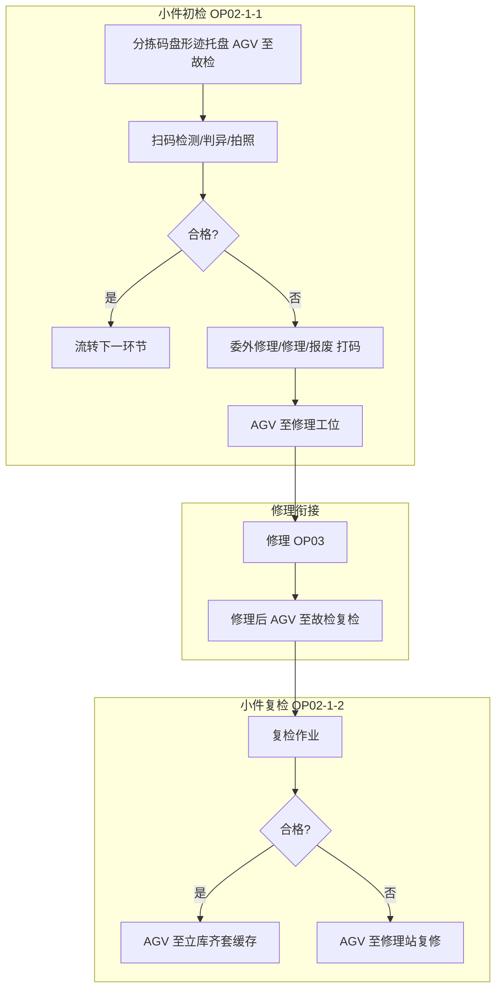
```mermaid
flowchart TB
  subgraph first [小件初检 OP02-1-1]
    direction LR
    S1[分拣码盘形迹托盘 AGV 至故检] --> S2[扫码检测/判异/拍照] --> S3{合格?}
    S3 -->|是| S4[流转下一环节]
    S3 -->|否| S5[委外修理/修理/报废 打码] --> S6[AGV 至修理工位]
  end
  subgraph bridge [修理衔接]
    direction LR
    S6 --> Repair[修理 OP03] --> R1[修理后 AGV 至故检复检]
  end
  subgraph recheck [小件复检 OP02-1-2]
    direction LR
    R1 --> R2[复检作业] --> R3{合格?}
    R3 -->|是| R4[AGV 至立库齐套缓存]
    R3 -->|否| R5[AGV 至修理站复修]
  end
```


**（2）大零件故检与复检（OP02-2）**

大零件故检不合格时，**不在修理工位执行厂内修理**：流转至修理工位仅完成委外登记、打印委外修理单，随后随大零件 AGV 转运至收发工位，进入委外发运流程。

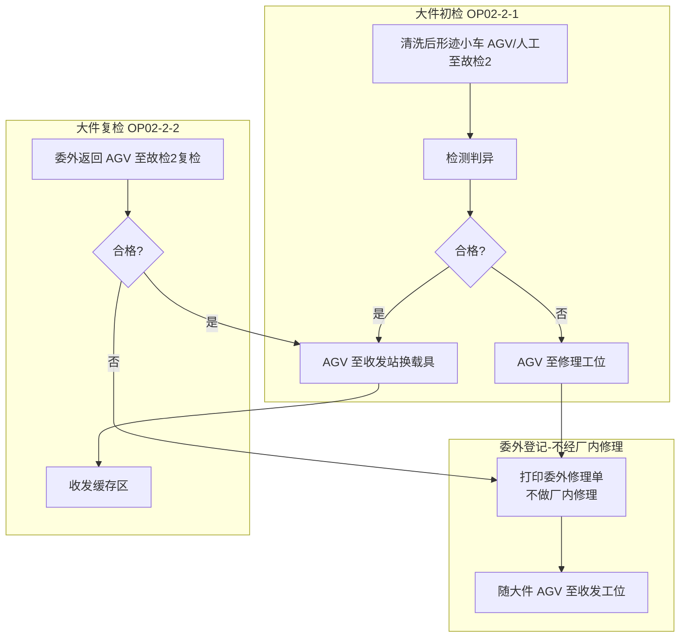
```mermaid
flowchart TB
  subgraph largeFirst [大件初检 OP02-2-1]
    direction LR
    L1[清洗后形迹小车 AGV/人工至故检2] --> L2[检测判异] --> L3{合格?}
    L3 -->|是| LR3[AGV 至收发站换载具]
    L3 -->|否| L4[AGV 至修理工位]
  end
  subgraph largeOutsource [委外登记-不经厂内修理]
    direction LR
    L4 --> L5[打印委外修理单<br/>不做厂内修理] --> L6[随大件 AGV 至收发工位]
  end
  subgraph largeRecheck [大件复检 OP02-2-2]
    direction LR
    LR1[委外返回 AGV 至故检2复检] --> LR2{合格?}
    LR2 -->|是| LR3 --> Rcv[收发缓存区]
    LR2 -->|否| L5
  end
```


**（3）故检作业步骤**

1. 操作员进入工卡详情页，查看零部件清单、工艺要求及检测公差标准（来自 WBS）
2. 扫码枪扫描零部件条码，系统定位并高亮对应检测任务
3. 副屏检测执行界面：
  - **数字量具检测项**：自动采集测量数据，依据工艺公差自动判异
  - **人工判定项**：工艺标注的难测项由人工判定合格/不合格
  - **拍照留痕**：工艺注明需拍照的不合格项，界面提示拍照；踩踏踏板或点击按钮拍照，支持预览与重拍
4. 不合格零件处置分类（三类）：
  - **委外修理**：由物料「默认委外」属性驱动，系统自动建议
  - **修理**（厂内）：需在本厂修理工位处置的零件
  - **报废**：含「只换不修」等策略对应的报废件。在故检工位确认的“报废件”，需要向车间PCS系统发起缺件申领
    报废件产生下列情形：
    1）.	“必换件”，工艺规定。
    2）.	“报废件-1”，工艺未规定，但零件寿命问题。
    3）.	“报废件-2”，故检检查后确认。
    4）.	“报废件-3”，修理后复检确认。

5. 确认后生成分类流转条码并打印，分类流转至修理工位或收发工位
6. 全部零件检测完成后提交故检执行结果，由服务端上报 PCS


#### 2.5 修理与处置作业流程（OP03）

本流程覆盖厂内修理、委外处置、报废登记三类场景，支持故检-修理-复检的循环闭环。

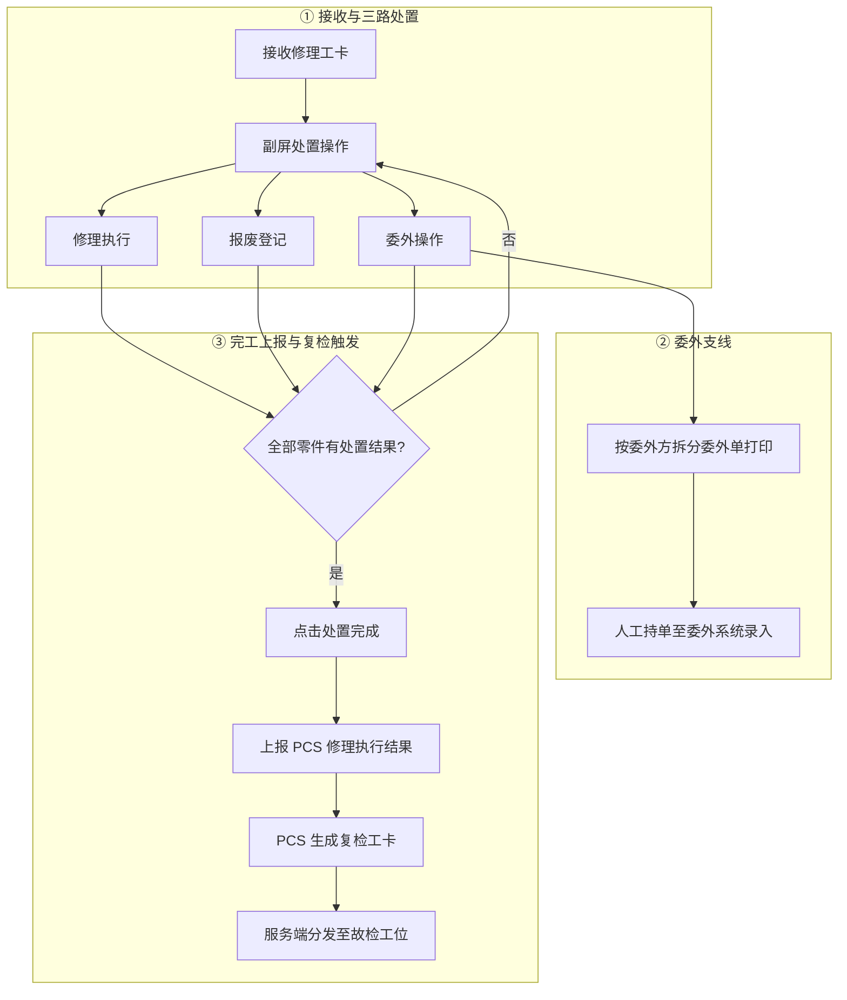
```mermaid
flowchart TB
  subgraph s1 [① 接收与三路处置]
    direction LR
    A[接收修理工卡] --> B[副屏处置操作]
    B --> C1[修理执行] & C2[委外操作] & C3[报废登记]
  end
  subgraph s2 [② 委外支线]
    direction LR
    C2 --> I[按委外方拆分委外单打印] --> J[人工持单至委外系统录入]
  end
  subgraph s3 [③ 完工上报与复检触发]
    direction LR
    C1 --> D{全部零件有处置结果?}
    C3 --> D
    C2 --> D
    D -->|否| B
    D -->|是| E[点击处置完成] --> F[上报 PCS 修理执行结果] --> G[PCS 生成复检工卡] --> H[服务端分发至故检工位]
  end
```


1. 操作员接收修理工卡，查看待处置零件清单与不合格原因
2. 副屏支持三类操作：
  - **修理执行**：选择维修方法、修理设备及工装，填写修理结论
  - **委外操作**：系统按物料属性默认勾选委外零件，支持手工增删；提交后生成唯一委托单编码，按委外方拆分为多张委外单，打印预览（委外系统物理隔离，人工持纸质单录入）
  - **报废登记**：多选零件报废，可选填备注
3. 工卡内所有零件均有执行结果（修理完成/委外/报废）后，「处置完成」按钮可用
4. 点击提交，修理执行结果由服务端上报 PCS
5. PCS 接收后生成复检工卡，重新下发至故检工位（待定），进入复检循环，直至合格、报废或委外出厂


#### 2.6 收发与线边库作业流程（OP04）

收发工位负责产线与立库、委外环节的交接，通过线边库实现零件缓存与分类管理。

**（1）小零件收发（OP04-1）**

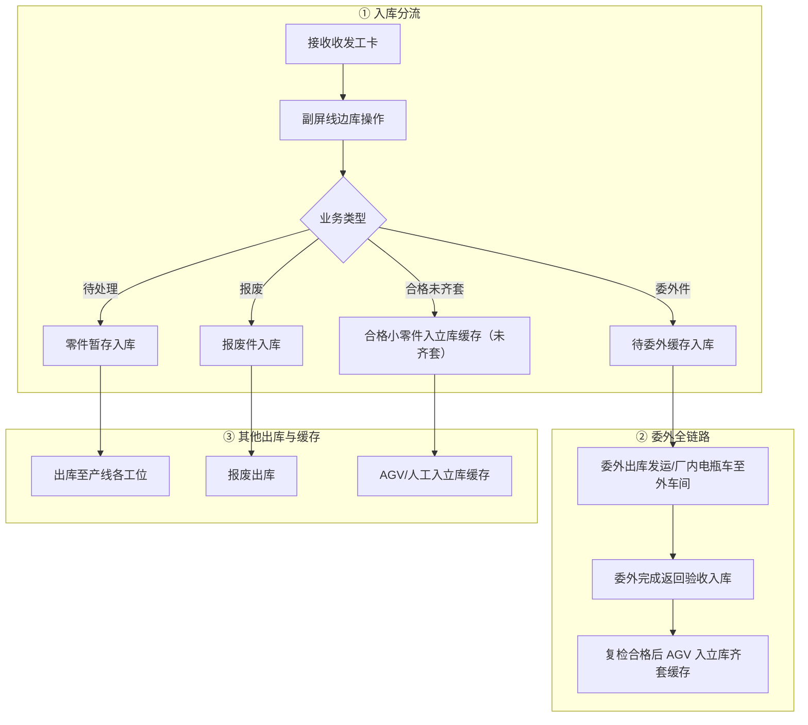
```mermaid
flowchart TB
  subgraph s1 [① 入库分流]
    direction LR
    A[接收收发工卡] --> B[副屏线边库操作] --> C{业务类型}
    C -->|委外件| D[待委外缓存入库]
    C -->|待处理| E[零件暂存入库]
    C -->|报废| F[报废件入库]
    C -->|合格未齐套| N[合格小零件入立库缓存（未齐套）]
  end
  subgraph s2 [② 委外全链路]
    direction LR
    D --> G[委外出库发运/厂内电瓶车至外车间] --> H[委外完成返回验收入库] --> I[复检合格后 AGV 入立库齐套缓存]
  end
  subgraph s3 [③ 其他出库与缓存]
    direction LR
    E --> J[出库至产线各工位]
    F --> K[报废出库]
    N --> M[AGV/人工入立库缓存]
  end
```

**业务说明**：

- **合格小零件入立库缓存（未齐套）**：故检合格但尚未与其他零件齐套的小零件，经收发工位登记后 AGV/人工入立库缓存。
- **出库至产线各工位**：原则上合格的小零件均须**先入立库**，再由立库发往产线各工位；除紧急「串件」外（实物可能直接转装配线，但账务须回传 PCS 与 WES），具体作业方式须与车间确认后落地。


**（2）大零件收发（OP04-2）**


```mermaid
flowchart TB
  subgraph s1 [大零件收发 OP04-2]
    direction LR
    A[大零件形迹托盘空盘 AGV 至收发缓存区] --> B[复检合格大零件至收发缓存] --> C[更换载具] --> D[AGV/人工入立库缓存]
  end
```


**（3）线边库三类库存**


| 库存类型      | 说明            |
| --------- | ------------- |
| 待委外缓存     | 等待委外发运的零件     |
| 零件暂存（待处理） | 产线各环节待继续处理的零件 |
| 报废        | 报废件，须执行报废出库动作 |


收发工位作业完成后，由服务端将工卡执行结果上报 PCS；线边库出入库流水在本系统内部记录。

#### 2.7 测量工具接入与数据采集流程

1. 新测量工具接入故检工位终端后，操作员在客户端「测量工具注册」界面扫描发现并注册
2. 选择工具类型，输入工具编号，完成注册；注册信息同步至服务端
3. 系统按工具类型加载驱动，通过串口 / Modbus RTU / Modbus TCP 等与测量工具通信
4. 故检作业时自动匹配测量工具，实时采集测量数据
5. 数据解析校验后写入工卡检测项并本地缓存，网络恢复后补传服务端
6. 持续监控测量工具在线状态，异常时弹窗报警并记录故障日志，支持呼叫技术员处理


#### 2.8 AGV 物流调用流程

本系统**不直接对接 AGV 调度系统**，所有 AGV 能力通过 **PCS-AGV 物流模块**实现，本系统仅作为工位侧调用入口。

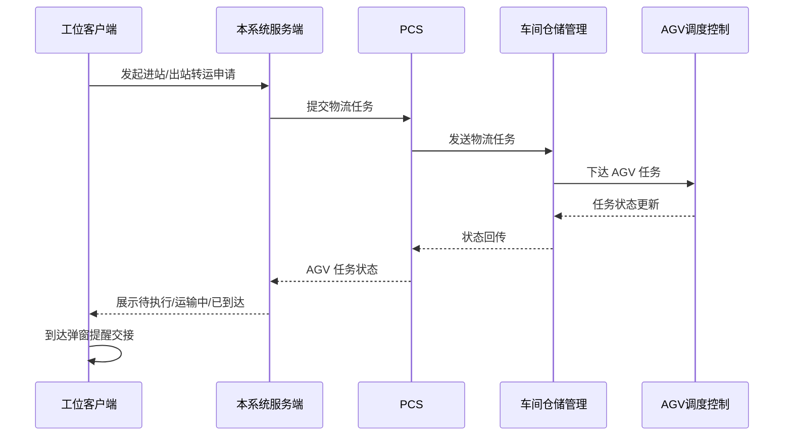
```mermaid
sequenceDiagram
  participant Client as 工位客户端
  participant Server as 本系统服务端
  participant PCS
  participant WMS as 车间仓储管理
  participant AGV as AGV调度控制
  Client->>Server: 发起进站/出站转运申请
  Server->>PCS: 提交物流任务
  PCS->>WMS: 发送物流任务
  WMS->>AGV: 下达 AGV 任务
  AGV-->>WMS: 任务状态更新
  WMS-->>PCS: 状态回传
  PCS-->>Server: AGV 任务状态
  Server-->>Client: 展示待执行/运输中/已到达
  Client->>Client: 到达弹窗提醒交接
```


1. 操作员完成作业后，在客户端点击「AGV 物流」发起进站或出站申请
2. 系统根据工位、载具、工卡信息自动生成转运任务
3. 服务端通过 PCS 接口提交至 PCS-AGV 模块
4. 客户端实时展示 PCS 回传的任务状态
5. AGV 到达时弹窗通知操作员完成交接


#### 2.9 异常呼叫与通知流程

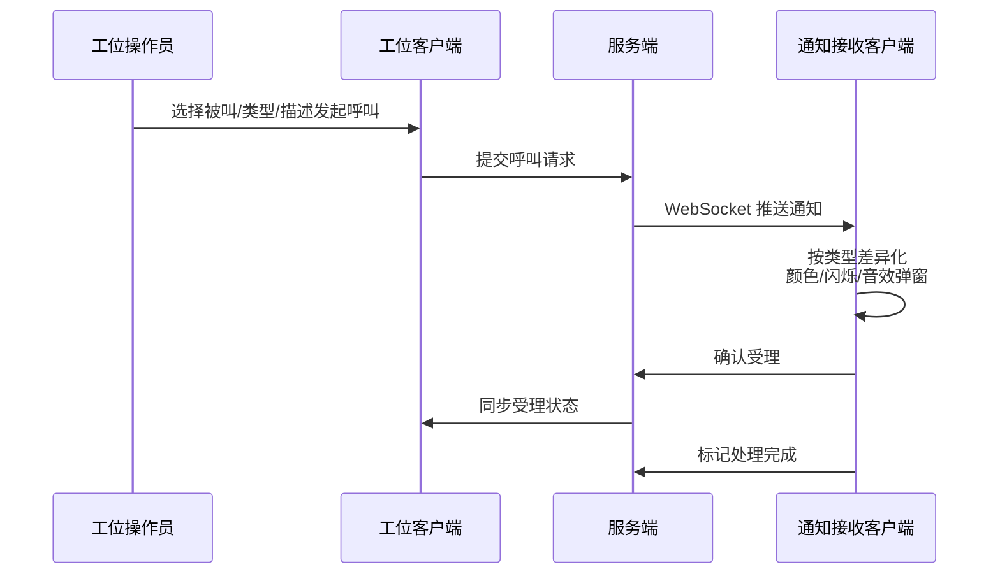
```mermaid
sequenceDiagram
  participant Op as 工位操作员
  participant WC as 工位客户端
  participant Server as 服务端
  participant NC as 通知接收客户端
  Op->>WC: 选择被叫/类型/描述发起呼叫
  WC->>Server: 提交呼叫请求
  Server->>NC: WebSocket 推送通知
  NC->>NC: 按类型差异化<br/>颜色/闪烁/音效弹窗
  NC->>Server: 确认受理
  Server->>WC: 同步受理状态
  NC->>Server: 标记处理完成
```


1. 工位操作员发起呼叫，选择被叫对象（技术员/操作员(组长)）、呼叫类型（测量工具/修理设备故障/技术求助/人员异常/物料异常）并填写描述
2. 服务端推送至对应人员的通知接收客户端
3. 通知客户端按类型展示不同颜色弹窗、闪烁效果与提示音
4. 被叫人员确认受理，处理完成后关闭，全程留痕


#### 2.10 产线物流架构

基于故检修理线物流架构，产线物流分为三类边界。本系统**不直连 AGV 调度控制系统**，工位侧物流申请与状态查询仅对接 **PCS-AGV 物流模块**；路径规划、车辆指派、交通管制等由 PCS 、AGV 调度系统完成。

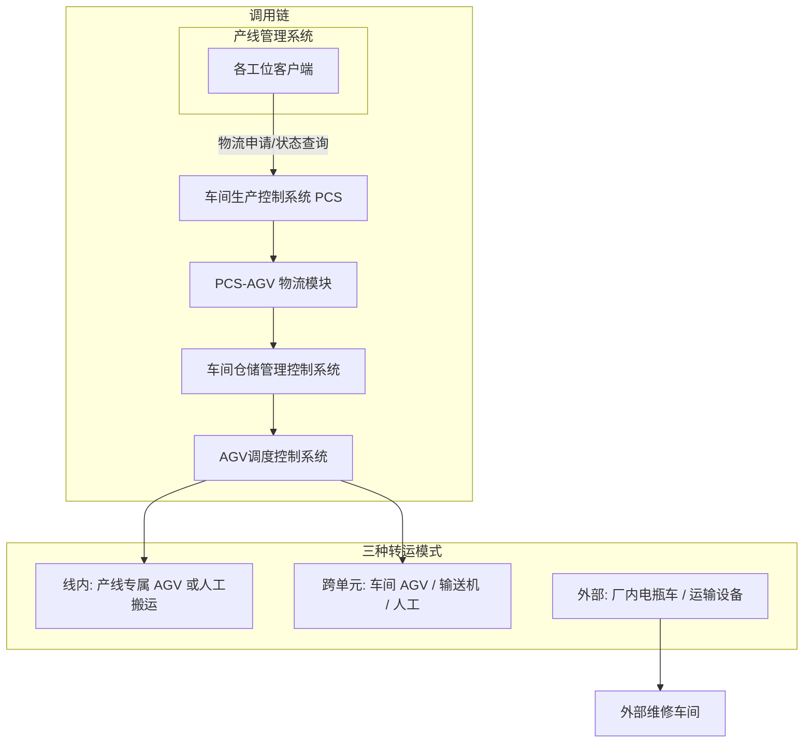
```mermaid
flowchart TB
  subgraph row1 [调用链]
    direction LR
    subgraph lineSys [产线管理系统]
      Stations[各工位客户端]
    end
    PCS[车间生产控制系统 PCS]
    PCSAGV[PCS-AGV 物流模块]
    WMS[车间仓储管理控制系统]
    AGVCtrl[AGV调度控制系统]
    Stations -->|物流申请/状态查询| PCS --> PCSAGV --> WMS --> AGVCtrl
  end
  subgraph row2 [三种转运模式]
    direction LR
    M1[线内: 产线专属 AGV 或人工搬运]
    M2[跨单元: 车间 AGV / 输送机 / 人工]
    M3[外部: 厂内电瓶车 / 运输设备]
  end
  AGVCtrl --> M1 & M2
  M3 --> ExtWorkshop[外部维修车间]
```


- **系统对接边界**：本系统 ↔ PCS（含 PCS-AGV 模块）；**不**与 AGV 调度控制系统建立直连接口
- **线内物流**：分拣、故检、修理、收发之间的转运，通过产线 AGV 或人工完成
- **跨单元物流**：产线与车间其他作业单元之间，通过车间 AGV、输送机或人工完成
- **外部物流**：产线与外部维修车间之间，通过厂内运输设备完成；委外系统与本系统无网络连接


## 三、功能模块


#### 3.1 功能架构图

系统采用「服务端 + 多类客户端」架构，服务端集中部署负责数据管理与业务协同，客户端分为工位客户端与通知接收客户端。

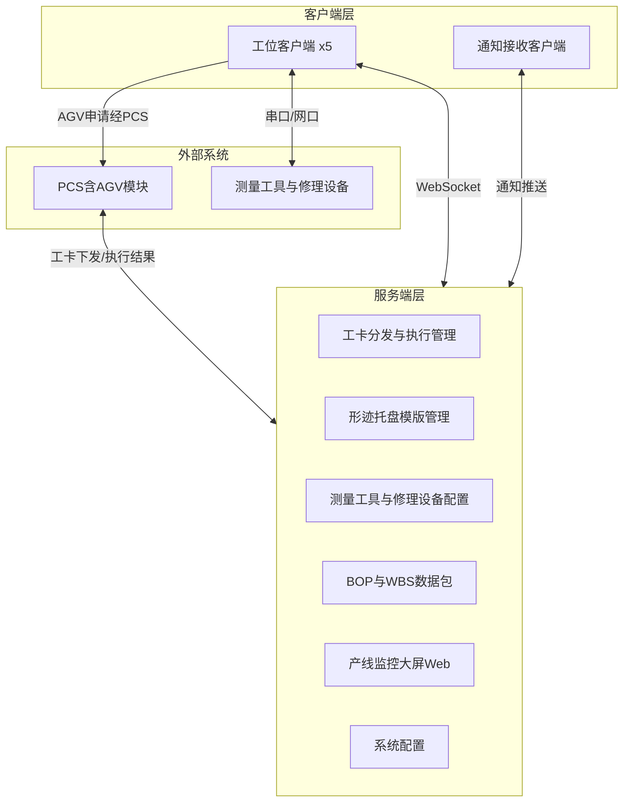
```mermaid
flowchart TB
  subgraph clients [客户端层]
    WC[工位客户端 x5]
    NC[通知接收客户端]
  end
  subgraph server [服务端层]
    S1[工卡分发与执行管理]
    S2[形迹托盘模版管理]
    S3[测量工具与修理设备配置]
    S4[BOP与WBS数据包]
    S5[产线监控大屏Web]
    S6[系统配置]
  end
  subgraph external [外部系统]
    PCS[PCS含AGV模块]
    DEV[测量工具与修理设备]
  end
  PCS <-->|工卡下发/执行结果| server
  WC <-->|WebSocket| server
  NC <-->|通知推送| server
  WC <-->|串口/网口| DEV
  WC -->|AGV申请经PCS| PCS
```


**架构说明：**

- **工位客户端层**：部署在分拣、故检1、故检2、修理、收发五类工位，提供工卡执行、测量与修理作业、物流申请及工位专属副屏作业
- **通知接收客户端**：部署在技术员、操作员(组长)办公电脑，用于接收现场异常呼叫通知
- **服务端层**：工卡分发、模版管理、数据管理、监控大屏、系统配置
- **外部系统层**：仅与 PCS 对接数据；AGV 通过 PCS 间接调用；测量工具与修理设备由工位客户端直连或人工操作留痕


#### 3.2 工位客户端功能

工位客户端部署于故检修理产线各工位终端，是操作员日常作业的主要入口。系统承接 PCS 经服务端下发的数字化工卡，将工卡执行、测量工具采集、修理设备操作、物流转运、线边库记账、异常呼叫等现场操作集中在一个桌面应用中，减少多系统切换与人工抄录；各工位根据配置仅接收与本工位类型匹配的任务，主屏负责工卡与通用操作，副屏承载分拣码盘、故检检测、修理处置或线边库等专属作业界面。

**（1）通用基础功能**

**a）工位配置**

客户端首次部署或产线工位调整时，可通过配置界面指定当前终端所属工位类型，可选值为：**分拣、故检1（小件）、故检2（大/小件）、修理、收发**。配置生效后，客户端仅接收并展示对应工位的工卡任务与功能菜单，避免操作员错接其他工位任务，也便于服务端按工位属性精准分发 PCS 下发的工卡。

**b）员工登录**

支持工号密码登录，绑定操作人员身份。工卡接受、检测录入、修理记录、出入库记账、异常呼叫等关键操作均自动关联当前登录人，作为质量追溯与审计留痕的依据。

**c）工卡全生命周期可视化管理**

工卡是产线作业的组织单元。客户端以 PCS 数字化工卡为数据源，在工位侧提供从接收、接受到执行、完工的全流程可视化管理。界面采用卡片式列表，按任务状态分色展示，操作员无需翻阅 PCS 即可直观掌握本工位待办任务，快速进入作业。


| 功能项    | 功能说明                                                                                                             |
| ------ | ---------------------------------------------------------------------------------------------------------------- |
| 工卡列表展示 | 按未接受/待处理/处理中/已完成四种状态分色展示，每张卡片集中呈现任务号、发布时间、接受时间、操作人及进度百分比等关键信息；不同状态采用差异化配色，便于操作员在繁忙现场一眼识别优先级与当前负载                 |
| 工卡详情查看 | 点击工卡卡片进入详情页，完整展示工序内容、工艺要求、检测项清单及公差标准；支持点击 WBS 关联的工艺文档、文件、视频链接，视频可直接在客户端内播放；操作员可在同一界面查阅全部作业依据，避免在 PCS 与工位终端之间反复切换 |
| 任务接受   | 操作员确认任务后一键接受，系统自动记录接受时间与操作人员，作为本系统内进度跟踪的时间锚点                                                                |
| 进度跟踪   | 实时计算并展示工卡执行进度百分比，支持按工序、按零部件粒度更新；进度变化在本系统内可视化呈现，便于操作员判断当前工卡完成度                                                    |


**d）零部件级任务分解与进度看板**

一张工卡往往包含多个零部件、多项检测或处置任务。客户端在工卡详情页自动解析工卡内容，将整体任务拆解为以零部件为单位的子任务看板，使复杂工卡在现场变得清晰可执行。每个零部件独立展示检测状态与结果，操作员可按零件逐项推进，避免遗漏或顺序混乱。


- **零部件清单**：自动解析工卡中的零部件信息，按品类分组展示（如缸体×1、活塞×1、旁通阀×4等），数量与工卡保持一致；清单结构与实际装配关系对应，便于操作员按实物核对
- **状态标识**：每个零部件独立展示检测或处置状态（待处理/检测中/已完成/不合格），并以「合格/不合格」等样式直观呈现最终结论；多零件并行作业时，不同状态一目了然，减少误判与重复作业
- **扫码定位**：操作员手持扫码枪扫描零部件条码，或通过界面「扫码识别零部件」按钮触发识别，系统自动定位并高亮对应检测任务区域；在零件较多、外观相近的场景下，可显著降低拿错件、测错项的风险
- **检测结果统计**：按零部件汇总检测或处置完成情况，如「检测完成（3合格、1不合格）」；操作员可快速判断本工卡是否具备提交执行结果的条件

**e）多类型测量工具统一接入与数据采集（故检工位）**

检测数据自动采集是本系统的核心价值之一。客户端通过统一测量工具接入框架，将工位上各类数字化测量工具与工卡检测项打通：测量值自动读取、自动填入、自动/手工判异，从根本上替代人工看表抄录，降低差错率、缩短单件检测周期。


| 功能项      | 功能说明                                                                                       |
| -------- | ------------------------------------------------------------------------------------------ |
| 测量工具注册管理 | 新测量工具接入工位后，客户端自动扫描发现并在「测量工具注册」界面提示；操作员选择工具类型、填写工具编号即可完成注册，注册信息同步至服务端，形成全产线统一的测量工具台账        |
| 多协议支持    | 内置串口、Modbus RTU、Modbus TCP 等主流工业通信协议，并支持按工具厂商协议定制驱动；同一工位可并存多种类型、多种接口的测量工具，无需为每种工具单独部署采集软件  |
| 自动数据采集   | 零件进入检测工位并完成扫码定位后，系统按检测项配置自动匹配对应测量工具，实时读取工艺值、公差及实际测量值并填入工卡表格；采集过程与作业节奏同步，操作员以确认与复核为主        |
| 自动判异     | 系统依据 WBS/工艺公差自动计算并判定每项测量结果的合格/不合格状态，不合格项以醒目样式高亮提示；减少依赖人工心算与经验判断，判异规则与 PCS 下发工艺标准保持一致       |
| 手动输入支持   | 在测量工具暂不可用、补测复核或特殊检测场景下，支持操作员手动输入测量值或覆盖自动判定结果；在保障自动化的同时，保留现场处置必要的灵活性                        |
| 检测图片管理   | 对表面划痕、裂纹等需图像留痕的检测项，将拍摄图片与测量数据、检测项绑定保存，支持现场预览与重拍；图片随工卡执行数据在本系统归档，并随工卡执行结果一并体现于上报 PCS 的工卡结果中 |


**f）测量工具状态监控与异常报警**

测量工具是自动采集链路的关键环节，工具断连或数据异常将直接影响工卡回填与执行结果完整性。客户端对已注册测量工具实施运行状态持续监测，在异常发生的第一时间提醒操作员，并留存故障记录，便于维护人员快速响应。


- **在线状态监控**：持续检测各已注册测量工具的在线/离线及通信健康状态，在工卡界面或工具监控视图中实时展示；操作员开工前可确认测量工具就绪，避免作业中途才发现连接失败
- **异常报警**：当测量工具断线、通信超时或采集数据异常时，立即弹出报警提示窗，明确故障工具与异常类型；减少静默失败导致的数据缺失，降低不合格品漏检风险
- **故障日志**：自动记录每次测量工具异常的时间、工具编号、故障描述等信息，形成可追溯的故障台账；为维护计划制定、备件管理与产线停机分析提供数据支撑

**g）异常呼叫**

故检修理现场测量工具或修理设备故障、工艺疑问、物料异常等情况时有发生，需要快速触达技术员或操作员(组长)。客户端内置呼叫功能，操作员在不离开工位、不中断当前工卡上下文的前提下即可发起求助，并附带问题类型与简要描述，缩短异常响应时间，降低因等待支持造成的产线停顿。


- **呼叫人员选择**：支持选择技术员、操作员(组长)作为被叫对象；按问题性质定向呼叫，提高响应针对性，避免广播式通知带来的信息淹没
- **呼叫类型**：提供测量工具/修理设备故障、技术求助、人员异常、物料异常四种标准类型；分类信息便于后台统计高频异常与优化预防性维护
- **问题描述**：支持填写简要文字说明，描述现场现象或需求；被叫人员在到场前即可预判所需工具、备件或工艺资料，提升一次解决率

**h）AGV 呼进呼出**

零件在分拣、故检、修理、收发等工位间的流转，直接影响产线节拍。客户端提供AGV 转运申请，与工卡作业流程同步并行，操作员完成本工位作业后无需离开界面、无需电话协调，即可一键发起物流任务，并全程掌握运输状态，实现「作业完成—物流触发—下工位衔接」的顺畅闭环。物流能力由 **PCS-AGV 模块**提供，本系统仅作为调用入口。


- **一键转运申请**：工卡详情页内置「AGV 物流」入口，操作员完成作业后一键触发进站或出站申请；界面操作简单，适合戴手套、高频作业的现场环境
- **任务自动生成**：系统根据当前工位、目标工位、绑定载具及工卡零件清单，自动组装完整转运任务，包含起点、终点、载具编号、零件清单及优先级；减少人工填写差错，缩短申请等待时间
- **状态实时跟踪**：通过 PCS 接口持续接收待执行、运输中、已到达等状态反馈，并在工卡界面同步展示；操作员可掌握物流进度，合理安排下道工序准备
- **到达通知**：AGV 抵达指定工位时，客户端主动弹窗提醒操作员，提示及时进行零件交接；避免靠人工盯守或口头传递造成的等待与积压
- **多载具支持**：支持形迹托盘、形迹小车、周转箱等多种产线常用载具的扫码绑定与转运申请；不同零件状态可对应不同载具类型，适配故检修理线多样化物流场景

**（2）分拣工位专属功能（主屏 + 副屏）**

分拣工位采用主屏+副屏双屏模式：主屏负责工卡管理与通用操作，副屏展示形迹托盘存料模版，实现可视化码盘与齐套校验，是小零件进入故检环节前的关键防错节点。

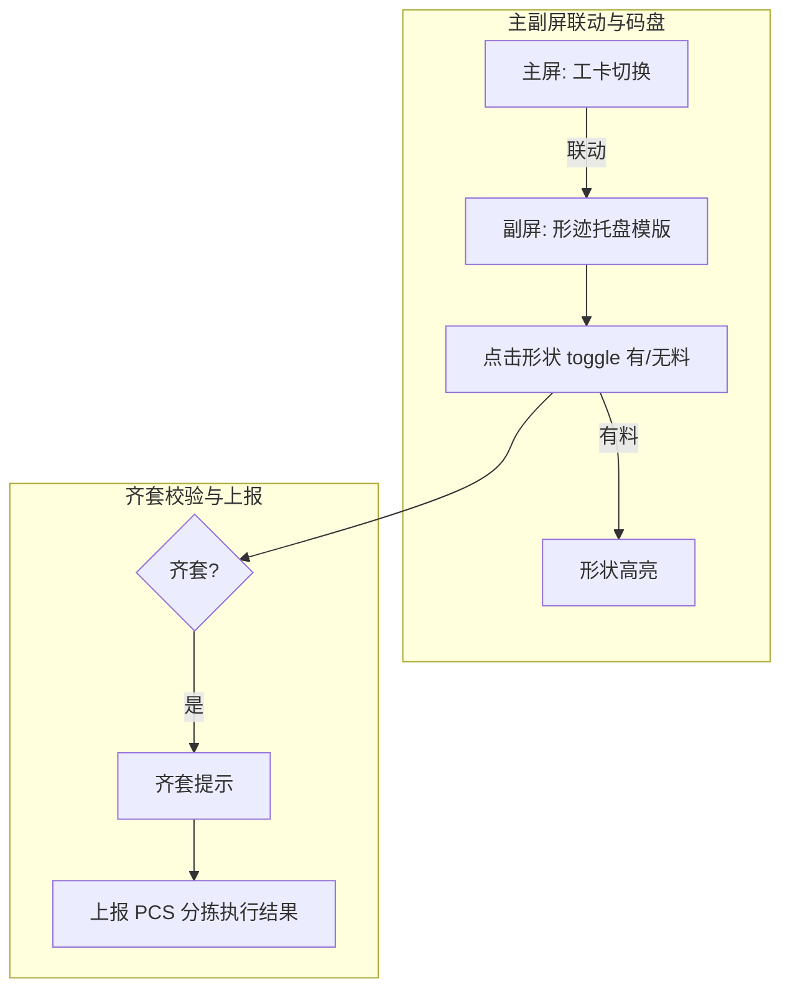
```mermaid
flowchart TB
  subgraph s1 [主副屏联动与码盘]
    direction LR
    Main[主屏: 工卡切换] -->|联动| Sub[副屏: 形迹托盘模版] --> Slot[点击形状 toggle 有/无料]
    Slot -->|有料| Highlight[形状高亮]
  end
  subgraph s2 [齐套校验与上报]
    direction LR
    Slot --> Kit{齐套?}
    Kit -->|是| Tip[齐套提示] --> Report[上报 PCS 分拣执行结果]
  end
```


- **模版联动切换**：主屏选中工卡后，副屏自动加载该工卡对应的形迹托盘存料模版，展示托盘实物图片与各卡槽位置；切换工卡即切换模版，避免人工选错托盘类型
- **可视化码盘**：副屏中每个卡槽对应一个半透明形状（圆形/正方形/自定义形状），标注对应物料种类编码；操作员将零件放入卡槽后，点击形状可切换「有零件/无零件」状态，有零件时形状高亮显示，实现账面相符的可视化确认
- **齐套校验**：系统实时比对工卡物料清单与当前卡槽选中状态，全部物料就位后弹出齐套完成提示；未齐套时明确提示缺项，减少带缺件托盘流入故检工位
- **齐套结果上报**：操作员确认齐套后提交分拣执行结果，由服务端汇总后上报 PCS，作为分拣工位完工依据；齐套后可发起 AGV 转运至故检工位

**（3）故检工位专属功能（故检1、故检2，主屏 + 副屏）**

故检1（小件）、故检2（大/小件）均采用主屏+副屏模式。主屏负责工卡与通用功能，副屏为检测执行界面，支持数字量具自动采集、人工判定难测项、拍照留痕与不合格分类打码，覆盖初检与 PCS 下发的复检工卡场景。

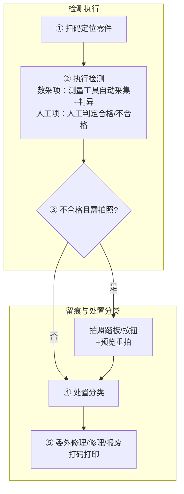
```mermaid
flowchart TB
  subgraph s1 [检测执行]
    direction LR
    A[① 扫码定位零件] --> B[② 执行检测<br/>数采项：测量工具自动采集+判异<br/>人工项：人工判定合格/不合格] --> C{③ 不合格且需拍照?}
  end
  subgraph s2 [留痕与处置分类]
    direction LR
    C -->|是| D[拍照踏板/按钮<br/>+预览重拍]
    C -->|否| E[④ 处置分类]
    D --> E --> F[⑤ 委外修理/修理/报废<br/>打码打印]
  end
```


- **双模式检测**：可对接数字量具的检测项由系统自动匹配测量工具、采集测量值并依据工艺公差判异；工艺标注的难以测量项由操作员人工选择合格/不合格，兼顾自动化与现场灵活性
- **拍照留痕**：工艺注明需拍照的不合格项，界面显示拍照标识；支持踩踏拍照踏板或点击界面按钮触发拍照，拍照后可预览效果并支持重拍；图片与检测项、零件绑定归档，支撑质量追溯
- **不合格分类打码**：检测完成后，系统根据物料属性（默认委外、只换不修等）自动给出处置建议（委外修理/修理/报废）；操作员确认后生成分类流转条码并支持标签打印，用于零件向修理工位或收发工位的物理分流标识
- **结果统一上报**：全部零件检测完成后统一提交故检工卡执行结果，由服务端上报 PCS；复检场景下若仍不合格，可再次流转修理，直至合格或报废

**（4）修理工位专属功能（主屏 + 副屏）**

修理工位主屏负责工卡与通用操作，副屏为处置操作界面，覆盖厂内修理、委外登记、报废登记三类能力，是衔接故检不合格处置与复检闭环的核心工位。

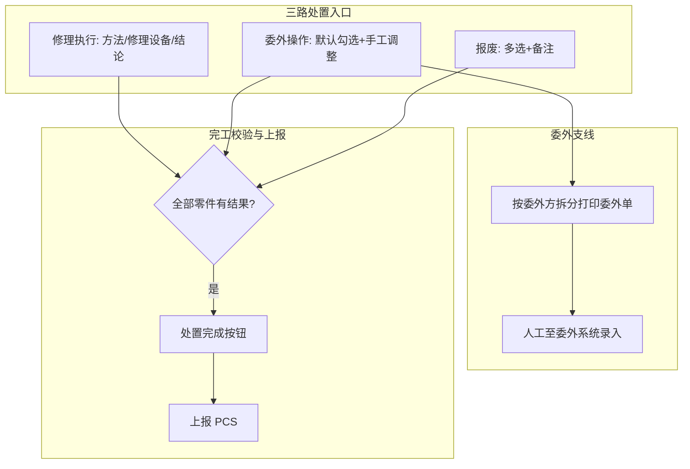
```mermaid
flowchart TB
  subgraph s1 [三路处置入口]
    direction LR
    R1[修理执行: 方法/修理设备/结论]
    R2[委外操作: 默认勾选+手工调整]
    R3[报废: 多选+备注]
  end
  subgraph s2 [委外支线]
    direction LR
    R2 --> Print[按委外方拆分打印委外单] --> Manual[人工至委外系统录入]
  end
  subgraph s3 [完工校验与上报]
    direction LR
    R1 --> Done{全部零件有结果?}
    R2 --> Done
    R3 --> Done
    Done -->|是| Btn[处置完成按钮] --> PCS[上报 PCS]
  end
```


- **修理执行记录**：针对厂内修理零件，选择维修方法、修理设备及工装，填写修理过程与结论，留存可追溯的修理过程记录
- **委外操作管理**：系统根据工卡物料属性默认勾选需委外的零件，支持人工新增勾选或取消默认委外；提交后生成唯一委托单编码，按委外方自动拆分为多张独立委外单，提供打印预览与批量打印；委外系统与本系统物理隔离，由操作员持纸质单据至委外系统人工录入
- **报废登记**：支持多选零件批量报废，可选填报废原因与备注，与线边库报废类库存联动记账
- **处置完成校验**：实时统计工卡内零件处置进度，当所有零件均生成执行结果（修理完成/委外/报废）后，「处置完成」按钮高亮可用；点击后统一上报修理工卡执行结果至 PCS，触发 PCS 生成复检工卡

**（5）收发工位专属功能（主屏 + 副屏）**

收发工位主屏负责工卡与通用操作，副屏为线边库操作界面，承担产线零件缓存、委外收发、报废出库及与立库交接等职能，是产线物流与库存的枢纽工位。


- **线边库分类管理**：线边库分为三类库存——**待委外缓存**、**零件暂存（待处理）**、**报废**，分区记账、独立统计；不同业务状态零件分区管理，避免混放、错发
- **出入库操作**：扫描载具或零件条码，选择库存类型与货位，确认数量后完成入库/出库记账；报废件须执行报废出库动作并留存凭证
- **委外收发登记**：委外零件出库发运、委外完成返回均通过收发工位登记，留存交接记录；委外完成件可暂存线边库等待故检复检或最终入立库
- **立库交接**：产线处理完成的合格零件、委外最终完成件，经收发工位核验后，发起 AGV 或人工转运存入立库缓存
- **执行结果上报**：收发工位工卡作业完成后，由服务端将工卡执行结果上报 PCS；线边库出入库流水在本系统内部记录


#### 3.3 通知接收客户端

通知接收客户端安装于技术员或操作员(组长)的办公电脑，需使用人员账号登录后使用，专门承接工位侧「呼叫与异常处理」能力，与工位客户端分工明确：一线发起、后台即时感知。

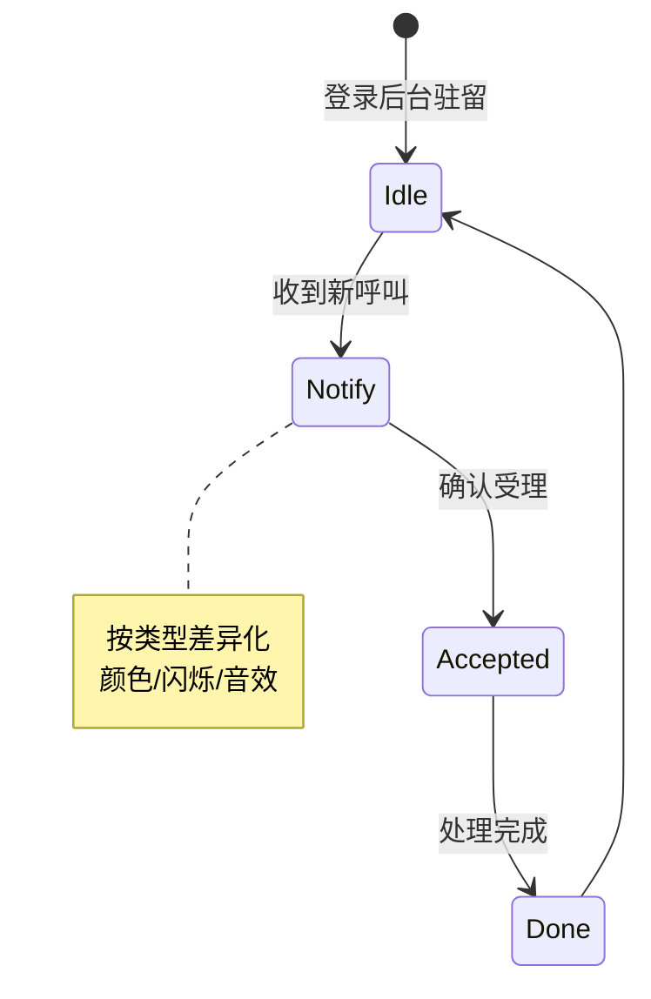
```mermaid
stateDiagram-v2
  [*] --> Idle: 登录后台驻留
  Idle --> Notify: 收到新呼叫
  Notify --> Accepted: 确认受理
  Accepted --> Done: 处理完成
  Done --> Idle
  note right of Notify: 按类型差异化<br/>颜色/闪烁/音效
```


- **账号登录**：使用人员账号登录，绑定对应角色与权限，仅接收权限范围内的呼叫通知，避免无关信息干扰
- **弹窗通知**：收到新呼叫时自动弹出通知窗口，展示呼叫工位、呼叫类型、问题描述与发起时间，便于快速判断现场情况
- **差异化提醒**：根据呼叫类型匹配不同的弹窗颜色、闪烁频率与提示音效（如测量工具/修理设备故障偏红与急促提示、技术求助偏橙、人员异常偏黄、物料异常偏蓝等，具体可配置），便于在办公环境中快速区分紧急程度
- **通知管理**：支持通知确认受理、标记处理完成、查看历史呼叫记录，处理全程留痕可追溯，并可同步受理状态至工位端
- **后台驻留**：支持最小化至系统托盘后台运行，新通知自动唤醒弹出，不影响技术员与操作员(组长)日常办公操作


#### 3.4 服务端功能模块

**（1）工卡分发与执行管理**

服务端对所有工卡的接收、分发、执行、回传进行集中管理，是 PCS 与多工位客户端之间的业务中枢。

- **工卡接收与分发**：统一接收 PCS 下发的完整工卡（含工位归属、物料属性、WBS 工艺信息及资料地址），按工位属性自动分发至分拣、故检1、故检2、修理、收发对应客户端；复检工卡到达时同样按规则再分发至故检工位
- **工卡状态跟踪**：在本系统内实时跟踪每张工卡的状态变化（未接受→待处理→处理中→已完成），记录各状态节点的时间与操作人员，支撑进度展示
- **执行结果管理**：归集各工位提交的工卡执行结果，完成完整性校验后向 PCS 上报工卡执行结果
- **执行明细查询**：提供工卡执行明细查询，包含每道工序、每个零件、每个检测项的详细执行记录，支撑质量追溯与问题复盘

**（2）形迹托盘存料模版管理**

形迹托盘配套专用泡沫内衬（常见材质有 EPE 珍珠棉、防静电 EVA 等），上面的孔洞/卡槽按零件外形定制，可实现零件的归置、防丢和可视化管理。服务端提供 Web 管理页面，作为分拣工位副屏可视化码盘的数据基础：

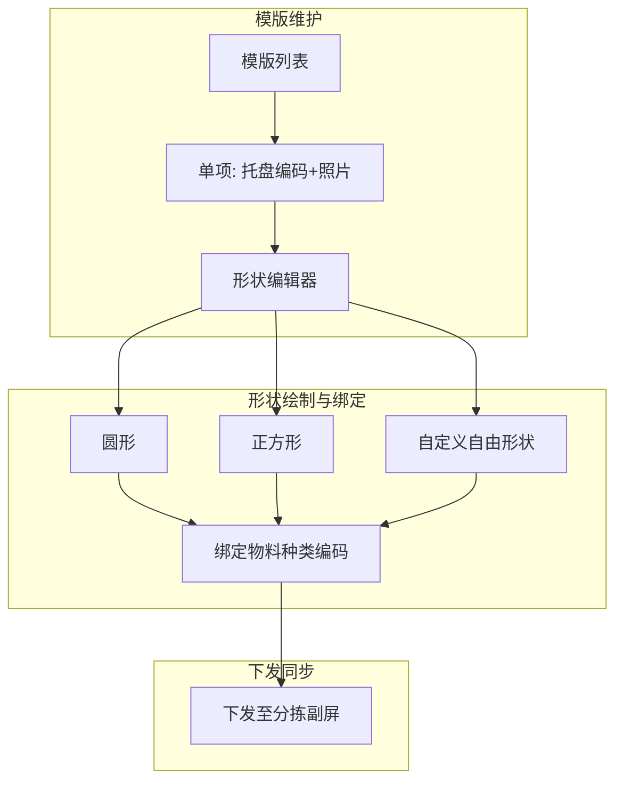
```mermaid
flowchart TB
  subgraph s1 [模版维护]
    direction LR
    List[模版列表] --> Item[单项: 托盘编码+照片] --> Edit[形状编辑器]
  end
  subgraph s2 [形状绘制与绑定]
    direction LR
    Edit --> Circle[圆形] & Rect[正方形] & Free[自定义自由形状]
    Circle --> Bind[绑定物料种类编码]
    Rect --> Bind
    Free --> Bind
  end
  subgraph s3 [下发同步]
    direction LR
    Bind --> Sync[下发至分拣副屏]
  end
```


| 功能项  | 说明                                                                   |
| ---- | -------------------------------------------------------------------- |
| 模版列表 | 以形迹托盘**编码**（非托盘实例）为唯一标识建立模版台账，每个列表项对应一张形迹托盘实物照片，便于管理员按托盘型号维护         |
| 形状编辑 | 支持在托盘图片上绘制半透明形状，操作逻辑类似 PowerPoint 形状编辑；支持圆形、正方形及自由绘制的自定义形状，精确圈定各卡槽区域 |
| 物料绑定 | 每个形状可绑定物料**种类尺寸唯一编码**（标识哪类尺寸的物料应放入该卡槽，而非单个零件实例），与 PCS 工卡物料清单一一对应     |
| 版本管理 | 支持模版修改与版本更新，变更后工位端自动同步最新模版，避免现场使用过期配置                                |
| 工卡联动 | 工卡分发时自动关联对应形迹托盘模版并推送至分拣副屏；操作员点击形状可 toggle 有/无料状态，有料时形状高亮，系统据此完成齐套判定  |


**（3）测量工具连接配置**

服务端提供统一的测量工具连接配置管理功能，支持对各类故检测量工具进行集中配置与管理，与工位客户端测量工具注册能力配合，形成全产线测量工具台账。


| 功能模块     | 功能说明                                                                                |
| -------- | ----------------------------------------------------------------------------------- |
| 测量工具档案管理 | 建立测量工具基础档案，包含工具编号、工具名称、工具类型、型号规格、生产厂家、出厂日期、校准周期等信息                                  |
| 连接参数配置   | 配置测量工具的连接参数，包括通信协议（串口/Modbus RTU/Modbus TCP）、IP 地址、端口号、波特率、数据位、停止位、校验位等；包括专用解析模版的配置 |
| 测量工具分组管理 | 按工位、按类型对测量工具进行分组管理，支持批量配置与批量升级，便于多工位同类测量工具的统一维护                                     |
| 测量工具状态监控 | 实时监控所有测量工具的在线/离线状态、运行状态、数据采集状态，为产线监控大屏与故障分析提供汇总数据                                   |
| 测量工具校准管理 | 记录测量工具校准历史，设置校准提醒，确保测量工具始终处于有效校准状态                                                  |
| 测量工具故障管理 | 记录测量工具故障信息，跟踪故障处理进度，统计测量工具故障率与平均无故障时间                                               |


**（4）数据接入与输出**

**a）数据接入**

服务端数据接入引擎负责接收来自客户端、测量工具、PCS 系统的各类数据，进行统一的解析、校验、存储。

- **多源数据接入**：支持工位客户端执行数据、测量工具采集测量数据、PCS 系统下发工卡数据等多源数据接入
- **协议解析引擎**：内置多种工业协议解析器，支持 Modbus RTU、Modbus TCP、TCP/IP、串口等多种协议的数据解析
- **数据校验**：对接入数据进行完整性校验、格式校验、范围校验、逻辑校验，确保数据质量
- **实时数据缓存**：采用内存缓存机制，保障高并发场景下的数据接入性能
- **断点续传**：支持网络中断后的数据断点续传，确保数据不丢失
- **接入日志**：完整记录所有数据接入日志，支持数据溯源与问题排查

**b）数据输出**

服务端提供统一的数据输出服务，向 PCS 上报各工位工卡执行结果。


| 输出类型   | 输出内容                              | 输出方式         |
| ------ | --------------------------------- | ------------ |
| 工卡执行结果 | 工卡完成状态、检测/处置明细、操作人员、时间节点及 L5 执行摘要 | 实时推送至 PCS 系统 |


- **标准化接口**：提供 TCP/IP 标准接口与 PCS 对接
- **数据格式转换**：支持 JSON、XML 等多种数据格式转换，适配 PCS 要求
- **权限控制**：数据输出接口支持权限认证与访问控制，确保数据安全
- **输出监控**：监控数据输出状态，异常时自动重试并告警

**（5）BOP 与 WBS 数据包管理**

**a）WBS 数据管理**

WBS（Work Breakdown Structure）是本系统组织工卡、检测任务与执行数据的核心模型。工卡自 PCS 下发时携带 WBS 树形结构，本系统提供 **WBS 标准结构**规范，PCS 按该规范组织本产线相关 WBS 数据（不含其他产线信息）。文档、文件、视频仅提供访问地址。

本系统负责**故检阶段与修理阶段** L5 工作包的执行数据填充（测量值、判定结论、检测图片、修理记录、处置结论、实际工时等），L1～L4 由 PCS/MES 等上游维护，本系统只读引用。

**（1）五层 WBS 分层逻辑**

编码规则：`WBS-{生产令号}-L{层级}-{序号}`


| 层级  | 名称      | 职责说明                   | 典型示例                                   |
| --- | ------- | ---------------------- | -------------------------------------- |
| L1  | 顶层项目    | 整机大修交付总目标              | `WBS-XXX-123-L1-001`：H130 型飞机左主起落架大修项目 |
| L2  | 全流程大修阶段 | 覆盖拆解→清洗→故检→修理→复装→测试→交付 | `WBS-XXX-123-L2-140`：故检与缺陷评估阶段         |
| L3  | 工序模块    | 独立工序包                  | 入厂清点、尺寸检测、缺陷评估                         |
| L4  | 零部件包    | 按 BOM 拆分的检测包           | 减震支柱组件尺寸检测                             |
| L5  | 最小工作包   | 可派工、可报工的最小单元           | 外筒内径三坐标测量                              |


**（2）L5 工作包核心业务字段**


| 字段                              | 说明         | 示例值                      |
| ------------------------------- | ---------- | ------------------------ |
| wbsCode                         | WBS 唯一编码   | `WBS-XXX-123-L5-142.1.1` |
| name / description              | 工作包名称与内容   | 外筒内径三坐标测量                |
| standardBasis                   | 适航/工艺依据    | H30 CMM 3.2.1 支柱外筒公差表    |
| inspectionTool                  | 指定测量工具     | 桥式三坐标测量机                 |
| planWorkHours / actualWorkHours | 计划/实际工时（h） | 6 / 5.8                  |
| status                          | 执行状态       | 待执行 / 检测中 / 已完成          |
| disposalResult                  | 处置结论       | 合格 / 自修 / 报废 / 委外        |


**（3）PCS 下发工卡中的 WBS 信息内容（对应 2.2 节）**

2.2 节要求 PCS 推送的工卡须携带完整 **WBS 信息**。本系统提供 WBS 标准结构，PCS 按该结构组织数据；**仅包含故检修理产线相关节点**（通常对应 L2 故检与缺陷评估、L2 修理等阶段及其下属 L3～L5），**不得夹带其他产线、其他大修阶段的 WBS 子树**，避免工位客户端展示冗余、误操作无关工序。

工卡内 WBS 信息在业务上须覆盖下表四类内容，本系统自 PCS 接收后只读展示，并在 L5 节点回填执行结果：


| 内容类别       | 承载层级                                                              | 用途说明                                    | 本系统侧行为                                  |
| ---------- | ----------------------------------------------------------------- | --------------------------------------- | --------------------------------------- |
| **工艺要求**   | L3～L5 的 `processRequirement` 或 `description`                      | 描述本工序/本检测包的操作步骤、注意事项、合格判定原则等文字性工艺要求     | 工卡详情页、副屏检测界面展示，供操作员现场查阅                 |
| **检测项**    | L5 的 `inspectionItems[]`                                          | 可执行的最小检测粒度：检测特征、标准值、公差、数采/人工属性、是否需拍照等   | 驱动副屏检测表格、测量工具自动匹配与判异、人工判定项              |
| **公差标准**   | 含于各检测项的 `nominalValue`、`upperTolerance`、`lowerTolerance`、`unit` 等 | 单项测量的合格区间，用于自动判异                        | 采集值与公差比对，不合格高亮                          |
| **工艺资料地址** | 各节点的 `processResources[]`                                         | 工艺文档、附件文件、教学视频的 **HTTP(S) 访问地址**（非文件本体） | 工卡详情提供链接；**视频在客户端内置播放器中直接播放**，无需跳转外部浏览器 |


**产线范围约束示例**：工卡 `workCardId=WC-2026-0618-001` 仅下发 `productionLineCode: "GJJ-XL-01"`（故检修理产线）且 `wbsScope: ["L2-140", "L2-150"]`（故检阶段、修理阶段）下的 WBS 子树；L2 拆解、L2 复装等与本产线无关的阶段节点由 PCS 裁剪，不进入本系统。

**（4）工艺要求**

工艺要求用于承载**文字性、段落性**的作业指导，与结构化检测项互补。推荐字段：


| 字段                 | 类型     | 说明                                              | 示例                                    |
| ------------------ | ------ | ----------------------------------------------- | ------------------------------------- |
| processRequirement | string | L3/L4/L5 工序级工艺要求正文，支持换行                         | 「测量前须校零三坐标测头；每件至少测 3 个截面，每截面 4 点均匀分布」 |
| description        | string | 工作包简述（可与 processRequirement 并存，description 偏概要） | 「测量外筒内孔圆度、圆柱度、导向段磨损量，对比原厂公差限值」        |
| standardBasis      | string | 适航/工艺依据编号                                       | `H30 CMM 3.2.1 支柱外筒公差表`               |


L3/L4 节点可仅含 `processRequirement` 与 `processResources`；**可派工、可填数的检测要求**应下沉至 L5 的 `inspectionItems`。

**（5）检测项与公差标准（inspectionItems）**

L5 工作包下的 `inspectionItems` 数组是本系统故检副屏、自动采集与判异的**直接数据源**，每一项对应工卡检测表格中的一行。推荐结构如下：


| 字段                 | 类型      | 必填       | 说明                                | 示例                   |
| ------------------ | ------- | -------- | --------------------------------- | -------------------- |
| itemCode           | string  | 是        | 检测项唯一编码，工卡内不重复                    | `INS-142.1.1-01`     |
| itemName           | string  | 是        | 检测项名称                             | `导向段内径 A 截面`         |
| feature            | string  | 否        | 检测特征/几何量类型                        | `内径`                 |
| nominalValue       | number  | 数采项必填    | 标准值（工艺值）                          | `120.000`            |
| upperTolerance     | number  | 数采项必填    | 上偏差（相对标准值，正数表示上限偏移）               | `0.050`              |
| lowerTolerance     | number  | 数采项必填    | 下偏差（相对标准值，负数表示下限偏移）               | `-0.020`             |
| unit               | string  | 是        | 计量单位                              | `mm`                 |
| dataCollectionType | enum    | 是        | `auto`：测量工具数采；`manual`：人工判定合格/不合格 | `auto`               |
| inspectionToolCode | string  | auto 时必填 | 指定测量工具类型或编号，用于客户端自动匹配             | `CMM-001`            |
| requirePhoto       | boolean | 否        | 不合格时是否必须拍照留痕                      | `true`               |
| manualOnly         | boolean | 否        | 难测项，仅人工判定、不绑定数采                   | `false`              |
| partRef            | string  | 否        | 关联零部件实例编码，与工卡物料清单对应               | `PART-OUTER-CYL-001` |


**公差判异规则（本系统实现）**：实测值 `actualValue` 满足  
`nominalValue + lowerTolerance ≤ actualValue ≤ nominalValue + upperTolerance` 为合格，否则不合格。  
例：标准值 120.000 mm，上偏差 +0.050、下偏差 -0.020 → 合格区间 **119.980～120.050 mm**。

**检测项列表示例（L5-142.1.1 外筒内径三坐标测量）**：


| itemCode       | itemName   | nominalValue | upperTolerance | lowerTolerance | unit | dataCollectionType |
| -------------- | ---------- | ------------ | -------------- | -------------- | ---- | ------------------ |
| INS-142.1.1-01 | 导向段内径 A 截面 | 120.000      | 0.050          | -0.020         | mm   | auto               |
| INS-142.1.1-02 | 导向段内径 B 截面 | 120.000      | 0.050          | -0.020         | mm   | auto               |
| INS-142.1.1-03 | 外观划伤目视检查   | —            | —              | —              | —    | manual             |


**（6）工艺资料访问地址（processResources）**

工艺文档、附件、视频**不随工卡打包传输**，由 PCS/CAPP 等上游系统提供 **URL 访问地址**，本系统工位客户端按链接拉取或在线打开。推荐挂载在 L3～L5 任意节点（与该项作业最相关的层级）。


| 字段               | 类型      | 必填        | 说明                                                              | 示例                                          |
| ---------------- | ------- | --------- | --------------------------------------------------------------- | ------------------------------------------- |
| resourceId       | string  | 是         | 资料唯一标识                                                          | `CAPP-H30-3210-0201`                        |
| resourceType     | enum    | 是         | `document`：工艺规程/作业指导书（PDF、Word 等）；`file`：图纸、附件；`video`：操作教学视频   | `video`                                     |
| title            | string  | 是         | 展示标题                                                            | `外筒内径三坐标测量操作教学`                             |
| url              | string  | 是         | **产线网可访问**的 HTTP/HTTPS 地址                                       | `https://capp.intra/files/H30-CMM-1421.mp4` |
| mimeType         | string  | 否         | 文件 MIME，便于客户端选择打开方式                                             | `video/mp4`、`application/pdf`               |
| playableInClient | boolean | video 时建议 | 为 `true` 表示须在工位客户端内嵌播放；本系统仅对 `playableInClient=true` 的视频启用内置播放器 | `true`                                      |


**视频地址要求（与 2.2 节、3.2.1 节工卡详情能力一致）**：

- 须为产线执行网（工位终端）**可直接访问**的地址，无需登录外网或跨密级跳转；
- 推荐 **MP4（H.264）** 等 Electron 内置播放器可解码格式；若使用 HLS，须确认客户端播放器能力；
- **不得**依赖浏览器插件、Flash、仅内网 DNS 解析不到的域名；
- PCS 下发时 `playableInClient: true` 的视频，操作员在工卡详情点击后在**客户端内全屏/窗口播放**，不强制打开系统默认浏览器，避免现场切换窗口。

**工艺资料列表示例**：


| resourceType | title                 | url                                              | playableInClient |
| ------------ | --------------------- | ------------------------------------------------ | ---------------- |
| document     | H30 CMM 3.2.1 支柱外筒公差表 | `https://capp.intra/docs/H30-CMM-3.2.1.pdf`      | —                |
| file         | 外筒检测定位工装示意图           | `https://capp.intra/files/fixture-outer-cyl.dwg` | —                |
| video        | 三坐标测量装夹与采点教学          | `https://capp.intra/video/CMM-1421-tutorial.mp4` | `true`           |


**（7）WBS 下发 JSON 结构示例（节选）**

以下示例展示 PCS 推送工卡时，**故检修理产线相关 L5 节点**如何同时携带工艺要求、检测项、公差与资料地址（与 2.2 节 WBS 信息行、上文字段定义对应）。

```json
{
  "workCardId": "WC-2026-0618-001",
  "productionLineCode": "GJJ-XL-01",
  "wbsScope": ["L2-140", "L2-150"],
  "wbsTree": {
    "wbsCode": "WBS-XXX-123-L5-142.1.1",
    "level": 5,
    "name": "外筒内径三坐标测量",
    "description": "测量外筒内孔圆度、圆柱度、导向段磨损量，对比原厂公差限值",
    "standardBasis": "H30 CMM 3.2.1 支柱外筒公差表",
    "processRequirement": "1. 测量前完成测头校零；2. 每件至少 3 个截面、每截面 4 点；3. 超差项须拍照并标注位置",
    "inspectionTool": "桥式三坐标测量机",
    "inspectionToolCode": "CMM-001",
    "planWorkHours": 6,
    "status": "待执行",
    "inspectionItems": [
      {
        "itemCode": "INS-142.1.1-01",
        "itemName": "导向段内径 A 截面",
        "feature": "内径",
        "nominalValue": 120.0,
        "upperTolerance": 0.05,
        "lowerTolerance": -0.02,
        "unit": "mm",
        "dataCollectionType": "auto",
        "inspectionToolCode": "CMM-001",
        "requirePhoto": true,
        "partRef": "PART-OUTER-CYL-001"
      },
      {
        "itemCode": "INS-142.1.1-02",
        "itemName": "外观划伤目视检查",
        "dataCollectionType": "manual",
        "manualOnly": true,
        "requirePhoto": true,
        "partRef": "PART-OUTER-CYL-001"
      }
    ],
    "processResources": [
      {
        "resourceId": "CAPP-H30-3210-0201",
        "resourceType": "document",
        "title": "H30 CMM 3.2.1 支柱外筒公差表",
        "url": "https://capp.intra/docs/H30-CMM-3.2.1.pdf",
        "mimeType": "application/pdf"
      },
      {
        "resourceId": "CAPP-VID-CMM-1421",
        "resourceType": "video",
        "title": "外筒内径三坐标测量操作教学",
        "url": "https://capp.intra/video/CMM-1421-tutorial.mp4",
        "mimeType": "video/mp4",
        "playableInClient": true
      }
    ]
  }
}
```


本系统接收后：在工卡详情展示 `processRequirement` 与 `processResources` 链接；故检副屏按 `inspectionItems` 渲染检测表；`dataCollectionType=auto` 项匹配测量工具采集并依公差判异；`manual` 项由操作员人工选择合格/不合格；视频链接在客户端内播放。

**（8）数据溯源机制（dataHistory）**

每个 WBS 节点挂载 `dataHistory` 数组，记录操作时间、操作类型、数据来源与详情，满足适航审计要求。`sourceType` 包括 MES、PCS、工位操作员、质量系统、外协平台等。

**（9）业务示例（节选）**

**L2 故检阶段 → L3 工序模块：**

```
WBS-XXX-123-L2-140  故检与缺陷评估阶段
├── L3-141  入厂清点与标识核验
├── L3-142  外观目视与尺寸精度检测
├── L3-143  无损探伤检测
├── L3-145  缺陷评估与处置判定
└── L3-146  故检资料归档与工单派发
```

**L5 处置结论示例：**


| wbsCode    | 工作包名称       | disposalResult | disposalRemark |
| ---------- | ----------- | -------------- | -------------- |
| L5-142.1.1 | 外筒内径三坐标测量   | 自修             | 局部磨损超差，本厂可镀铬修复 |
| L5-142.1.2 | 内筒外径与腐蚀深度检测 | 报废             | 腐蚀坑超 CMM 报废限值  |
| L5-142.1.3 | 活塞密封沟槽尺寸检测  | 委外             | 需激光熔覆，指定委外方    |
| L5-142.2.1 | 碳刹车盘厚度检测    | 合格             | 剩余厚度满足要求       |


**（10）本系统与 WBS 的衔接关系**

- **自 PCS 接收**：工卡携带 WBS 树；L5 含 `processRequirement`、`inspectionItems`（检测项与公差）、`processResources`（工艺文档/文件/视频 URL）；仅本产线相关子树
- **本系统填充**：故检与修理阶段 L5 执行数据（测量值、判定结论、检测图片、修理记录等）写入节点并追加 dataHistory
- **回传 PCS**：工位工卡执行结果上报时携带 L5 执行摘要，由 PCS 更新数字化工卡
- **与 BOP 联动**：工卡完工时汇总生成 BOP 执行数据包

**b）BOP 执行数据包**

BOP（Bill of Process，工艺过程清单）执行数据包是工卡执行过程中产生的完整数据集合。本系统作为工位侧执行系统，**负责保存和展示故检修理产线相关的 BOP 数据**——即分拣、故检、修理、收发各工位在执行过程中产生或汇聚的工艺与执行记录，供技术员、检验员等角色浏览与质量追溯。


| 数据类别     | 包含内容                            |
| -------- | ------------------------------- |
| 工艺基础数据   | 工卡信息、零部件清单、工艺路线、检测项清单、公差标准、工艺参数 |
| 执行过程数据   | 操作人员、开始/结束时间、各工序执行记录、操作日志       |
| 检测结果数据   | 各项测量值、合格判定结果、测量工具信息、检测图片/视频     |
| 处置结果数据   | 修理记录、委外记录、报废记录、分类流转信息           |
| 测量工具运行数据 | 使用测量工具编号、工具状态、工具运行参数、校准信息       |
| 物料流转数据   | 零部件出入库记录、AGV 转运记录、载具信息          |
| 异常处理数据   | 不合格项记录、返工记录、呼叫记录、异常处理结果         |


- **数据包生成**：工卡执行完成后自动生成 BOP 执行数据包，汇总该工卡在本产线各工位的执行痕迹
- **数据包存储**：采用结构化存储与文件存储相结合的方式，确保数据完整性与查询效率
- **数据包查询**：支持按工卡号、零件号、批次号、时间范围等多维度查询 BOP 执行数据包
- **质量追溯**：基于 BOP 执行数据包实现从入厂分拣、故检、修理到处置完成的本产线全流程质量追溯

**（6）系统配置管理**

- **用户与角色管理**：维护产品技术员、生产准备技术员、故检员、操作员、试验员、检验员、器材保管工、生产准备工等账号与角色权限，支撑客户端登录与通知推送的权限隔离
- **工位基础配置**：维护工位编码、工位类型、所属产线等基础信息，与客户端工位配置能力对应
- **系统参数配置**：维护系统运行基础参数、告警规则、通知策略（含呼叫类型与声光提醒策略）等
- **日志审计**：提供操作日志、登录日志、数据变更日志等审计数据的查询与管理，满足内控与问题排查需要


#### 3.5 产线状态监控大屏

产线数据大屏以 Web 端全屏方式集中展示故检修理产线的实时运行态势，数据来源于本系统服务端对客户端工卡执行、测量工具采集、线边库等业务的汇聚统计，通过 WebSocket 推送实现近实时刷新。**大屏仅用于生产状态可视化监控**，报表导出功能。


采用模块化卡片布局，主要展示内容如下：


| 功能模块     | 功能说明                                                                  |
| -------- | --------------------------------------------------------------------- |
| 工位运行概览   | 以仪表盘或卡片形式展示分拣、故检1、故检2、修理、收发各工位的实时作业量与负载情况，便于技术员、检验员等授权人员快速掌握各工位产能分布 |
| 工卡负载统计   | 按工位统计当前在制工卡数量，以进度条或数值卡片呈现工卡负载水位，辅助识别任务积压工位                            |
| 测量工具连接状态 | 汇总各工位已注册测量工具的在线/离线数量及异常占比，及时感知产线测量工具可用性                               |
| AGV 调度任务 | 展示经 PCS 回传的 AGV 转运任务列表，包含起止工位、执行状态（待执行/运输中/已到达）及当前进度                  |
| 线边库库存水位  | 以水位图或柱状图展示线边库三类库存（待委外缓存、零件暂存、报废）的水平与周转状况                              |
| 质量与效率统计  | 汇总合格率、处置分布（修理/委外/报废）等基础 KPI 指标，支撑现场运行态势概览                             |


## 四、技术方案


#### 4.1 前端技术栈

所有客户端（工位客户端、通知接收客户端）采用 Electron + Vite + Node.js 技术栈。

**（1）核心技术选型**


| 技术         | 版本       | 用途说明      |
| ---------- | -------- | --------- |
| Electron   | 最新 LTS   | 跨平台桌面应用框架 |
| Vite       | 5.x      | 前端构建工具    |
| Node.js    | 18.x LTS | 主进程业务逻辑   |
| React      | 18.x     | 响应式 UI 框架 |
| TypeScript | 5.x      | 类型安全      |


**（2）关键技术特性**

- 原生串口通信（serialport）、SQLite 本地缓存、WebSocket 实时通信
- 自动更新、离线运行、**主屏+副屏**多窗口支持
- 内置视频播放组件，支持 WBS 工艺视频地址客户端内播放

**（3）性能与安全**

- Vite 构建优化、懒加载、虚拟列表
- Electron 安全最佳实践（contextIsolation、preload）
- 基于角色的功能权限控制


#### 4.2 后端技术栈

服务端采用 Node.js + PostgreSQL 技术栈。

**（1）核心技术选型**


| 技术               | 版本       | 用途说明                                    |
| ---------------- | -------- | --------------------------------------- |
| Node.js          | 18.x LTS | 服务端运行时                                  |
| Express          | 4.x      | Web 框架（Node.js + TypeScript/JavaScript） |
| PostgreSQL       | 15.x     | 关系型数据库                                  |
| Redis            | 7.x      | 缓存与会话                                   |
| TypeScript       | 5.x      | 类型安全                                    |
| Prisma / TypeORM | 最新稳定版    | ORM                                     |


**（2）关键技术特性**

- WebSocket 实时推送、TCP/IP 与 PCS 通信
- Redis 缓存形迹托盘模版、工卡热点数据
- 支持服务集群与负载均衡

**（3）数据库设计要点**

**核心业务表：**


| 表名                    | 说明                 |
| --------------------- | ------------------ |
| work_card             | 工卡主表               |
| work_card_execution   | 工位执行结果             |
| tray_template         | 形迹托盘模版（托盘编码、照片）    |
| tray_slot_shape       | 卡槽形状（坐标 JSON、物料编码） |
| inspection_data       | 检测数据               |
| outsource_order       | 委外单（含唯一编码、委外方）     |
| scrap_record          | 报废记录               |
| line_side_inventory   | 线边库库存              |
| inventory_transaction | 出入库流水              |
| measurement_tool      | 测量工具档案             |
| notification_log      | 呼叫通知日志             |


- 系统配置表：用户、角色权限、工位配置、系统参数
- 日志审计表：操作、登录、数据变更日志
- JSON 字段：检测项配置、BOP 数据包、形状坐标、WBS 节点数据
- 按时间分区的大数据量表


#### 4.3 集成方案

**（1）与 PCS 系统对接方案**

系统与 PCS 通过 TCP/IP 双向交互，向 PCS 上报各工位工卡执行结果。


| 对接方向         | 数据内容                    | 通信方式      | 频率    |
| ------------ | ----------------------- | --------- | ----- |
| PCS → 本系统服务端 | 完整工卡（工位、物料属性、WBS 及资料地址） | TCP/IP 推送 | 实时    |
| 本系统 → PCS    | 各工位工卡执行结果               | TCP/IP 上报 | 实时    |
| 双向           | 心跳、重连                   | TCP/IP    | 每 5 秒 |


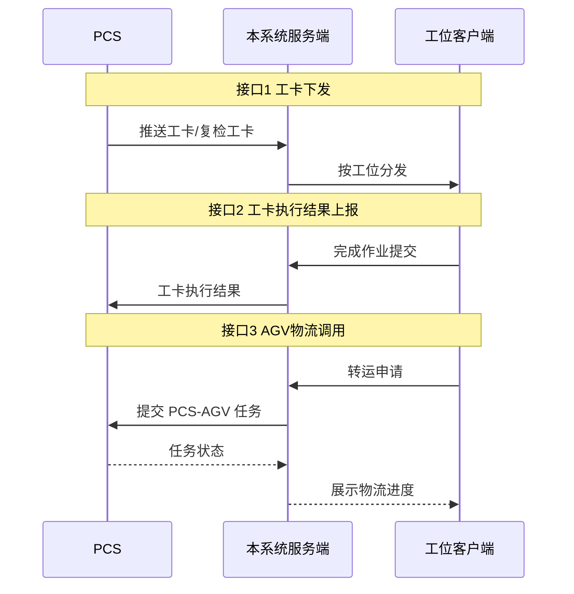
```mermaid
sequenceDiagram
  participant PCS
  participant Server as 本系统服务端
  participant Client as 工位客户端
  Note over PCS,Client: 接口1 工卡下发
  PCS->>Server: 推送工卡/复检工卡
  Server->>Client: 按工位分发
  Note over PCS,Client: 接口2 工卡执行结果上报
  Client->>Server: 完成作业提交
  Server->>PCS: 工卡执行结果
  Note over PCS,Client: 接口3 AGV物流调用
  Client->>Server: 转运申请
  Server->>PCS: 提交 PCS-AGV 任务
  PCS-->>Server: 任务状态
  Server-->>Client: 展示物流进度
```


**a）核心接口说明**

1. **工卡下发接口**：PCS → 服务端，含工位、物料（默认委外/委外方/只换不修）、WBS（本产线工艺与资料 URL）；服务端 → 客户端分发
2. **工卡执行结果上报接口**：本系统 → PCS，各工位完工时上报检测/处置明细、操作人员、时间等
3. **AGV 物流调用接口**：本系统 → PCS 提交转运申请，PCS 回传任务状态

**（2）与测量工具对接方案**

工位客户端直连测量工具，数据写入本系统，随工卡执行结果一并体现在上报 PCS 的工卡结果中。

**a）支持的测量工具类型**

几何量（气动量仪、三坐标、轮廓仪等）、光学测量、力学性能及定制测量工具。

**b）支持的通信协议**


| 协议类型           | 物理接口   | 适用场景     |
| -------------- | ------ | -------- |
| 串口 RS232/RS485 | DB9、端子 | 传统测量工具   |
| Modbus RTU     | RS485  | 工业现场测量工具 |
| Modbus TCP     | 以太网    | 智能测量工具   |
| TCP/IP 自定义     | 以太网    | 高端测量工具   |
| USB HID        | USB    | 便携测量工具   |


**（3）AGV 物流调用说明**

本系统**不直接对接 AGV 物流系统**，所有调度通过 **PCS-AGV 物流模块**实现。

- **调用链**：工位客户端 → 服务端 → PCS → 车间仓储管理 → AGV 调度
- **功能边界**：本系统负责申请提交、状态展示、到达提醒；不涉及路径规划与车辆管理
- **优势**：复用车间 PCS-AGV 统一调度体系


## 五、用户操作用例

本章定义系统各角色的典型用户操作用例。本系统角色包括：**产品技术员、生产准备技术员、故检员、操作员、试验员、检验员、器材保管工、生产准备工**。其中操作员按工位与职责可细分为操作员(分拣)、操作员(修理)、操作员(组长)等现场岗位，账号角色统一归属「操作员」，通过工位配置与权限策略区分作业范围。

#### 5.1 角色权限矩阵

本系统**不设领导、调度员角色**。大屏仅供生产状态监控，由技术员、检验员等授权角色查看。


| 功能模块       | 产品技术员 | 生产准备技术员 | 故检员 | 操作员    | 试验员 | 检验员 | 器材保管工 | 生产准备工 |
| ---------- | ----- | ------- | --- | ------ | --- | --- | ----- | ----- |
| 产线监控大屏     | 查看    | 查看      | -   | -      | -   | 查看  | -     | -     |
| 工卡管理       | 查看    | 查看      | 执行  | 执行     | 执行  | 查看  | 执行    | -     |
| 测量工具管理     | 配置    | 配置      | 使用  | 使用     | 使用  | -   | -     | 维护    |
| 形迹托盘模版管理   | 配置    | -       | -   | -      | -   | -   | -     | -     |
| AGV 物流申请   | -     | -       | 申请  | 申请     | 申请  | -   | 申请    | -     |
| 线边库管理      | 查看    | -       | -   | -      | -   | -   | 管理    | -     |
| 修理/委外/报废处置 | 查看    | -       | -   | 执行     | -   | 查看  | -     | -     |
| 异常呼叫       | -     | -       | 发起  | 发起     | 发起  | -   | 发起    | -     |
| 异常通知接收     | 接收    | -       | -   | 接收(组长) | -   | -   | -     | -     |
| 系统配置       | -     | 配置      | -   | -      | -   | -   | -     | -     |


> 说明：「操作员(组长)」为操作员角色中具备异常通知接收权限的班组负责人；「操作员(修理)」等在修理工位执行修理/委外/报废处置，权限体现于上表「操作员」列。


#### 5.2 产品技术员用例


| 用例 UC-001：工艺配置、模版管理与异常通知 |                                                                   |
| ------------------------ | ----------------------------------------------------------------- |
| 任务描述                     | 产品技术员配置形迹托盘存料模版，维护测量工具与工艺参数，查询 BOP 数据包与质量数据；并通过通知接收客户端响应现场技术类异常呼叫 |
| 操作人员角色                   | 产品技术员                                                             |
| 工具/界面功能                  | 形迹托盘模版管理、测量工具配置、BOP 数据包管理、通知接收客户端                                 |
| 输入                       | 托盘形状绘制与物料绑定、质量查询条件、呼叫通知确认受理                                       |
| 输出                       | 模版配置结果、BOP 执行数据包、质量统计、呼叫处理记录                                      |


#### 5.3 生产准备技术员用例


| 用例 UC-002：测量工具配置与系统管理 |                                          |
| --------------------- | ---------------------------------------- |
| 任务描述                  | 生产准备技术员负责故检测量工具注册配置、系统参数设置、用户权限管理等系统准备工作 |
| 操作人员角色                | 生产准备技术员                                  |
| 工具/界面功能               | 测量工具管理、系统配置、用户权限管理                       |
| 输入                    | 测量工具注册信息、系统参数、权限设置                       |
| 输出                    | 测量工具连接状态、配置生效结果                          |


#### 5.4 操作员用例（分拣工位）


| 用例 UC-003：分拣码盘与齐套作业 |                                         |
| ------------------- | --------------------------------------- |
| 任务描述                | 操作员在分拣工位接收分拣工卡，对照形迹托盘模版码放零件，完成齐套校验后发起转运 |
| 操作人员角色              | 操作员（分拣工位）                               |
| 工具/界面功能             | 工卡列表、副屏形迹托盘模版、齐套校验、AGV 申请               |
| 输入                  | 工卡接受、卡槽 toggle、齐套确认、AGV 申请              |
| 输出                  | 齐套结果、分拣工卡执行结果上报 PCS                     |


#### 5.5 故检员用例


| 用例 UC-004：故检与复检作业 |                                          |
| ----------------- | ---------------------------------------- |
| 任务描述              | 故检员执行初检或复检工卡，使用测量工具或人工判定完成检测，对不合格件分类打码流转 |
| 操作人员角色            | 故检员                                      |
| 工具/界面功能           | 工卡列表、副屏检测界面、测量工具采集、拍照、打码打印               |
| 输入                | 扫码、测量、人工判定、拍照、处置分类确认                     |
| 输出                | 检测记录、流转码、故检工卡执行结果上报 PCS                  |


#### 5.6 操作员用例（修理工位）


| 用例 UC-005：修理与处置作业 |                                                             |
| ----------------- | ----------------------------------------------------------- |
| 任务描述              | 操作员(修理)在修理工位接收工卡，执行厂内修理、委外登记（打印委外单后人工录入委外系统）、报废操作，全部处置完成后提交 |
| 操作人员角色            | 操作员(修理)                                                     |
| 工具/界面功能           | 副屏处置界面、修理记录、委外单打印、报废登记                                      |
| 输入                | 修理记录、委外勾选、报废登记、处置完成确认                                       |
| 输出                | 修理/委外/报废记录、委外单、修理工卡执行结果上报 PCS                               |


#### 5.7 器材保管工用例


| 用例 UC-006：线边库与收发作业 |                                                |
| ------------------ | ---------------------------------------------- |
| 任务描述               | 器材保管工在收发工位负责线边库三类库存管理、委外零件收发、合格件入立库交接，维护库存账实一致 |
| 操作人员角色             | 器材保管工                                          |
| 工具/界面功能            | 副屏线边库界面、出入库、委外收发、AGV 申请                        |
| 输入                 | 载具扫码、出入库确认、报废出库、立库交接                           |
| 输出                 | 库存台账、收发工卡执行结果上报 PCS                            |


#### 5.8 操作员用例（组长）


| 用例 UC-007：异常通知接收与响应 |                                             |
| ------------------- | ------------------------------------------- |
| 任务描述                | 操作员(组长)通过通知接收客户端接收现场异常呼叫，按类型识别紧急程度并及时组织协调响应 |
| 操作人员角色              | 操作员(组长)                                     |
| 工具/界面功能             | 通知接收客户端、差异化弹窗、历史通知                          |
| 输入                  | 登录、确认受理、处理完成                                |
| 输出                  | 通知提醒、处理记录、工位端状态同步                           |


#### 5.9 试验员用例


| 用例 UC-008：性能试验执行 |                                     |
| ---------------- | ----------------------------------- |
| 任务描述             | 试验员在试验工位对修理后的零部件进行性能试验验证，确认修理质量是否达标 |
| 操作人员角色           | 试验员                                 |
| 工具/界面功能          | 工卡列表、试验数据采集、试验报告生成、试验设备管理           |
| 输入               | 工卡接受、试验设备启动、试验参数设置、试验结果确认           |
| 输出               | 试验数据记录、合格/不合格判定、试验报告、工卡执行结果         |


#### 5.10 检验员用例


| 用例 UC-009：质量检验与审核 |                                          |
| ----------------- | ---------------------------------------- |
| 任务描述              | 检验员对故检、修理、试验结果进行质量审核，查阅 BOP 数据包，确认最终质量状态 |
| 操作人员角色            | 检验员                                      |
| 工具/界面功能           | BOP 数据包查看、质量统计、产线监控大屏                    |
| 输入                | 工卡查询、BOP 数据包审阅、检验结果确认                    |
| 输出                | 检验审核记录、质量统计报表                            |


#### 5.11 生产准备工用例


| 用例 UC-010：测量工具日常维护与工装准备 |                                            |
| ----------------------- | ------------------------------------------ |
| 任务描述                    | 生产准备工负责测量工具日常维护、校准检查、工装夹具准备，确保生产前测量工具与工装就绪 |
| 操作人员角色                  | 生产准备工                                      |
| 工具/界面功能                 | 测量工具状态监控、测量工具维护记录、校准管理                     |
| 输入                      | 测量工具点检记录、维护保养记录、校准结果录入                     |
| 输出                      | 测量工具点检记录、维护保养日志、校准证书归档、测量工具异常报修            |


## 六、部署实施方案


#### 6.1 部署架构

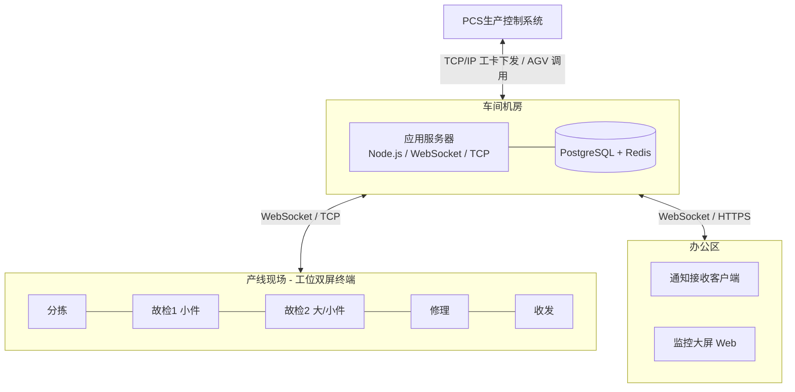
```mermaid
flowchart TB
  PCS[PCS生产控制系统]

  subgraph dc [车间机房]
    direction LR
    Server[应用服务器<br/>Node.js / WebSocket / TCP] --- DB[(PostgreSQL + Redis)]
  end

  subgraph floor [产线现场 - 工位双屏终端]
    direction LR
    S1[分拣] --- S2[故检1 小件] --- S3[故检2 大/小件] --- S4[修理] --- S5[收发]
  end

  subgraph office [办公区]
    direction LR
    NC[通知接收客户端]
    Dash[监控大屏 Web]
  end

  PCS <-->|TCP/IP 工卡下发 / AGV 调用| dc
  dc <-->|WebSocket / TCP| floor
  dc <-->|WebSocket / HTTPS| office
```


系统采用「集中式服务端 + 分布式多类客户端」架构：服务端部署车间机房；工位客户端部署五类工位双屏终端；通知接收客户端部署技术员、操作员(组长)办公电脑；监控大屏通过浏览器访问。

#### 6.2 硬件要求

**（1）服务端硬件**


| 设备类型   | 配置要求                            | 数量      | 部署说明                     |
| ------ | ------------------------------- | ------- | ------------------------ |
| 应用服务器  | CPU 8核+、内存 16GB+、500GB SSD、千兆网卡 | 1台（主备）  | Node.js、WebSocket、TCP 服务 |
| 数据库服务器 | CPU 8核+、内存 32GB+、1TB SSD RAID1  | 共用或单独1台 | PostgreSQL、Redis         |
| 备份存储   | 2TB+、定期备份                       | 1套      | 数据与文件备份                  |


**（2）工位客户端硬件**


| 设备类型  | 配置要求                                              | 数量    | 部署说明             |
| ----- | ------------------------------------------------- | ----- | ---------------- |
| 工位终端  | i5+、8GB+、256GB SSD、主屏21.5寸+副屏21.5寸、串口×2、USB×4 | 每工位1套 | 分拣、故检1、故检2、修理、收发 |
| 扫码枪   | 一维/二维码、USB或串口                                     | 按需    | 各工位              |
| 标签打印机 | 不干胶标签                                             | 按需    | 故检、修理工位打码/委外单    |
| 拍照踏板  | 脚踏开关 USB                                          | 按需    | 故检工位             |
| 测量工具  | 串口/网口、提供协议文档                                      | 按需    | 故检工位             |
| 修理设备  | 按工艺配置（磨床、焊接设备等）                                   | 按需    | 修理工位             |


**（3）通知接收客户端硬件**


| 设备类型 | 配置要求                   | 数量  | 部署说明            |
| ---- | ---------------------- | --- | --------------- |
| 办公电脑 | 普通办公配置、Windows 10+ | 按需  | 技术员、操作员(组长)桌面 |


#### 6.3 软件环境

**（1）服务端软件**


| 软件         | 版本                            | 说明        |
| ---------- | ----------------------------- | --------- |
| 操作系统       | CentOS 7.x / Ubuntu 20.04 LTS | Linux 服务器 |
| Node.js    | 18.x LTS                      | 运行时       |
| PostgreSQL | 15.x                          | 数据库       |
| Redis      | 7.x                           | 缓存        |
| Nginx      | 1.20+                         | 反向代理      |
| PM2        | 最新稳定版                         | 进程管理      |


**（2）客户端软件**


| 软件      | 版本                             | 说明      |
| ------- | ------------------------------ | ------- |
| 操作系统    | Windows 10+ | 工位与办公桌面 |
| 工位客户端   | Electron 桌面应用                  | 含主屏+副屏  |
| 通知接收客户端 | Electron 桌面应用                  | 托盘驻留    |
| 测量工具驱动  | 按测量工具定制                        | 测量工具    |


#### 6.4 实施步骤

**需求调研与方案确认（第1周）**

- 确认五工位功能范围与 OP01–OP04 业务流程
- 确认测量工具清单与通信协议
- 确认 PCS 接口规范
- 确认形迹托盘模版数量与绘制需求

**系统开发与配置（第2-6周）**

- 服务端：形迹托盘模版管理、工卡分发、WBS/BOP、通知推送
- 工位客户端：五工位通用+专属功能、双屏适配
- 通知接收客户端
- 测量工具驱动、PCS 接口（含 PCS-AGV）、复检工卡闭环联调

**部署安装与联调（第7周）**

- 服务端部署、五工位双屏客户端安装
- 测量工具连接测试、PCS 联调、形迹托盘模版导入

**试运行（第8-10周）**

- 分岗位培训、小范围试运行、问题收集与稳定性测试

**正式上线与验收（第11周）**

- 正式上线、验收交付、运维交接


#### 6.5 培训方案


| 培训对象          | 培训内容                 | 时长      | 方式    |
| ------------- | -------------------- | ------- | ----- |
| 系统管理员         | 架构、部署、权限、备份、故障排查     | 0.25天      | 现场+演练 |
| 生产技术人员        | 形迹托盘模版、测量工具配置、BOP 查询 | 0.5天    | 现场演示  |
| 操作员（5个工位）      | 工卡执行、副屏操作、异常处理       | 0.5天 | 实操练习  |
| 技术员/操作员(组长) | 通知客户端、监控大屏查看         | 0.25天    | 现场演示  |


#### 6.6 运维保障

**（1）运维组织**

- 系统管理员：日常运维、用户管理、备份、故障处理
- 测量工具维护员：测量工具维护、校准、故障排查
- 技术支持：远程支持

**（2）数据备份策略**

- 数据库每日全量备份，保留 30 天
- 检测图片、托盘模版文件定期备份
- 关键数据异地备份

**（3）故障响应**

- 7×24 技术支持热线；一般问题 2 小时内响应，重大故障 8 小时内现场

**（4）系统升级**

- 客户端自动更新；服务端滚动升级；版本管理制度


#### 6.7 风险与应对


| 风险项          | 风险等级 | 应对措施                     |
| ------------ | ---- | ------------------------ |
| 测量工具协议不明确    | 中    | 提前获取协议，优先主流测量工具，预留定制时间   |
| PCS 接口变更     | 中    | 提前确认数据边界，建立变更沟通机制        |
| 形迹托盘模版绘制工作量大 | 中    | 提前收集照片与物料映射，可视化编辑工具批量配置  |
| 复检工卡闭环联调复杂   | 中    | 与 PCS 方提前约定复检工卡触发规则，专项联调 |
| 用户操作习惯改变     | 低    | 分岗位培训，设置过渡期              |
| 网络不稳定        | 低    | 客户端离线缓存，恢复后同步            |
| 数据安全风险       | 低    | 权限控制、加密传输、定期审计与备份        |


## 七、疑点与推荐方案

| 序号 | 疑点 | 结论 |
| --- | --- | --- |
| 7.1 | AGV 直连智能物流系统 vs 经 PCS-AGV | **经 PCS-AGV 间接调用**，全车间 AGV 统一向 PCS 请求 |
| 7.2 | 复检/复修在原工卡追加 vs 新增工卡 | **按轮次新增工卡并建立关联**，符合 MRO 派工报工习惯 |
| 7.3 | 跨网对接委外系统 vs 离线提交 | **打印委外单 + 人工录入**，尊重网络密级与安全边界 |
| 7.4 | 故检工位报废件缺件申请发起方 | **待客户确认**（故检工位 vs 修理工位） |
| 7.5 | 修理工位报废件缺件申请发起方 | **待客户确认**（修理工位 vs 故检工位） |
| 7.6 | 合格件入立库路径（2.1 主流程） | **待客户确认**（故检直转立库 vs 经收发工位） |
| 7.7 | 修理工位报废登记与线边库入账确认节点（3.2.4 第656行） | **待客户确认**（修理工位即入账 vs 收发工位实物确认入账；账物合一） |
| 7.8 | 故检工位报废件缺件申领机制（与PCS联动） | **待客户确认**（实时逐件申领 vs 周期性批量申领；PCS物料属性字段能力待确认） |
| 7.9 | 修理站报废件缺件申领路径 | **待客户确认**（回故检站发起 vs 修理站自增缺件申领功能） |
| 7.10 | 合格大零件换载具地点（OP04-2） | **待客户确认**（收发站换载具 vs 立库前换载具） |
| 7.11 | 未齐套转运支持（分拣工位） | **待客户确认**（是否允许未齐套转运；如允许则按需适配系统功能） |
| 7.12 | 故检工位报废登记功能与报废件账务确认 | **待客户确认**（故检工位增加报废登记 vs 保持现状；入账确认是否统一至收发工位） |
| 7.13 | 形迹托盘存料模版管理（3.4 第708行） | **待客户确认**（功能范围是否满足业务需求） |


